# APS Python 기본 

`APS ( Algorithm Problem Solving )`

## 2020/01/30 (목)


### 1. 배열 1 (Array 1)

> - 알고리즘
> - 배열
> - 완전검색
> - 그리디 ( Greedy Algorithm )
> - 버블 정렬 ( Bubble Sort )
> - 카운팅 정렬 ( Counting Sort )
> - 실습1, 2 


- 디버깅
  - 논리적인 오류를 찾아낼 수 있음..
  - 논리적인 오류가 없는 상황에서 결과를 돌려보면 내가 원하는 결과가 나오지 않을 때가 있음
    그때 디버깅을 사용하면 어디서 잘못됬는지 확인할 수 있음
  - 


#### (1) 알고리즘

___

> 알고리즘 : 유한한 단계를 통해 문제를 해결하기 위한 절차나 방법
> 					주로 컴퓨터용어로 쓰이며, 컴퓨터가 어떤 일을 수행하기 위한 단계적 방법을 말한다.
>
> 어떠한 문제를 해결하기 위한 절차

- 1부터 100까지의 합을 구하는 문제
  - 1 + 2 + 3 + ... + 100 = 5,050


- 수도코드
  - 컴퓨터 분야에서 알고리즘을 표현 하는 방법은 크게 두 가지
    - 수도코드
    - 순서도

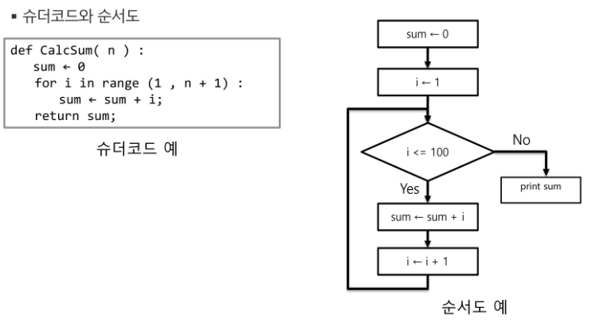


- 알고리즘의 성능은 무엇으로 측정하는가.

  - APS 과정의 목표 중의 하나는 보다 좋은 알고리즘을 이해하고 활용하는 것이다.
  - 무엇이 좋은 알고리즘인가?
    - `정확성` : 얼마나 정확하게 동작하는가
    - `작업량` : 얼마나 적은 연산으로 원하는 결과를 얻어내는가
    - `메모리 사용량` : **얼마나 적은 메모리를 사용**하는가 ( 임베디드에서 중요 )
    - `단순성` : 얼마나 단순한가
    - `최적성` : 더 이상 개선할 여지없이 최적화되었는가

  

  - 주어진 문제를 해결하기 위해 여러 개의 다양한 알고리즘이 가능

    - 어떤 알고리즘을 사용해야 하는가?

  - 알고리즘의 성능 분석 필요

    - 많은 문제에서 성능 분석의 기준으로 알고리즘의 작업량을 비교한다.

  - 예 )  1부터 100까지 더하는 알고리즘

  - 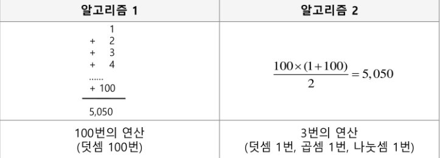

  - **시간 복잡도** = (빅오 표기법)

    - 빅-오 표기법
    - 시간 복잡도 함수 중에서 가장 큰 영향력을 주는 n에 대한 항만을 표시
    - 계수는 생략하여 표시

    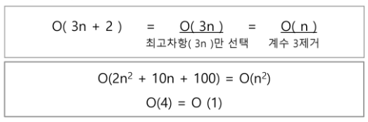

    - n개의 데이터를 입력 받아 저장한 후 각 데이터에 1씩 증가시킨 후 각 데이터를 화면에
      출력하는 알고리즘의 시간 복잡도는 어떻게 되나?

      **O(n)**

    - 시간 복잡도별 실제 실행 시간 비교
      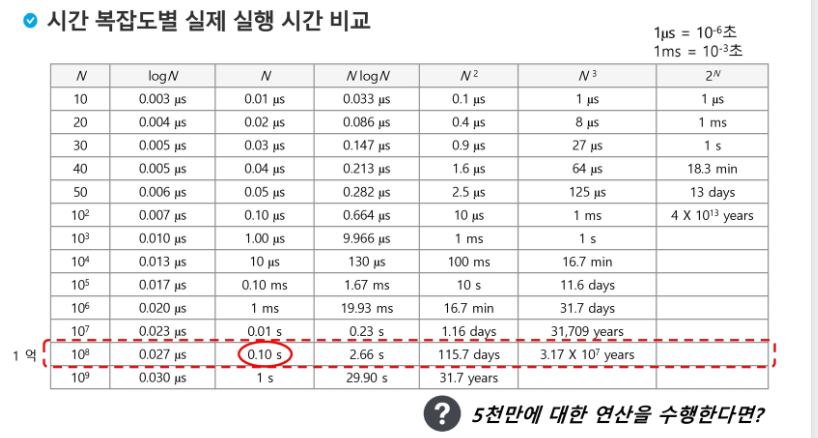


#### (2) 배열

___

- 배열이란 무엇인가

  - 일정한 자료형의 변수들을 하나의 이름으로 열거하여 사용하는 자료구조
  - 아래의 예는 6개의 변수를 사용해야 하는 경우, 이를 배열로 바꾸어 사용하는 것이다.
    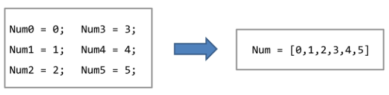

- 배열의 필요성

  - 프로그램 내에서 여러 개의 변수가 필요할 때, 일일이 다른 변수명을 이용하여 자료에 접근하는 것은
    매우 비효율적일 수 있다.
  - 배열을 사용하면 하나의 선언을 통해서 둘 이상의 변수를 선언할 수 있다.
  - 단순히 다수의 변수 선언을 의미하는 것이 아니라, 다수의 변수로는 하기 힘든 작업을 배열을 활용해 
    쉽게 할 수 있다.

- 1차원 배열의 선언

  - 별도의 선언 방법이 없으면 변수에 처음 값을 할당할 때 생성

  - 이름 : 프로그램에서 사용할 배열의 이름
    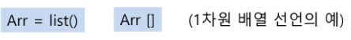

  - ```python
    arr = [0] * 10    # arr = list() 배열(리스트)은 100만개정도... 만들수있음
    
    arr[0] = 1
    arr[3] = 10
    arr[9] = 50
    
    print(arr)
    ```

    

- 1차원 배열의 접근
  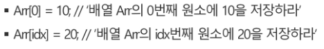

- <연습문제1 : Gravity >

  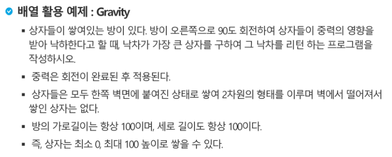

  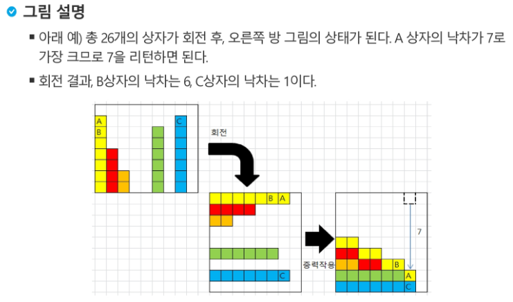

  - 입력
    - data[100] : 회전하기 전 상자들이 쌓여있는 모양을 나타내는 data.
      앞의 예시에서는 [7, 4, 2, 0, 0, 6, 0, 7, 0]
  - 사용코드
    - data 배열은 랜덤하게 채워진다.


#### (3) 완전 검색 (Exaustive Search)

___

> 역테 A형에서 묻는 수준

- 모든 경우의 수를 나열해보고 확인하는 기법
- `Brute-Force` 혹은 generate-and-test 기법이라고도 불린다.
- **모든 경우의 수를 테스트**한 후, 최종 해법을 도출한다.
- 일반적으로 **경우의 수가 상대적으로 작을 때 유용**하다. ( 시간문제 때문에 )


1. 완전 검색으로 시작하라.
   - 모든 경우의 수를 생성하고 테스트하기 때문에 **수행 속도는 느리지만**, 해답을 찾아내지 못할 확률이 작다.
   - 자격검정평가 등에서 주어진 문제를 풀때, **우선 완전 검색으로 접근하여 해답을 도출**한 후,
     **성능 개선을 위해 다른 알고리즘을 사용**하고 해답을 확인하는것이 바람직


(1) 순열을 어떻게 생성할 것인가

- 순열( Permutation )

  - 서로 다른 것들 중 몇 개를 뽑아서 한 줄로 나열하는 것

  - 서로 다른 n개 중 r개를 택하는 순열은 아래와 같이 표현한다.

    ```
    nPr
    ```

  - 그리고 nPr 은 다음과 같은 식이 성립한다.

    ```
    nPr = n * (n-1) * (n-2) * ... * (n-r+1)
    ```

  - nPn = n! 이라고 표기하며 `Factorial` 이라고 부른다.

- 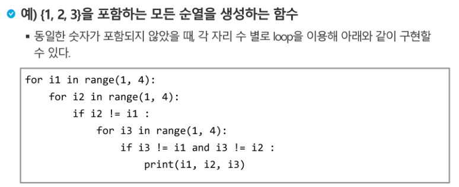


#### (4) 탐욕 알고리즘

___

> - 탐욕 알고리즘은 최적해를 구하는데 사용되는 근시안적인 방법
>
> - 여러 경우 중 하나를 결정해야 할 때마다 그 순간에 최적이라고 생각되는 것을 선택해 나가는 방식으로
>   진행하여 최종적인 해답에 도달한다.
> - 각 선택의 시점에서 이루어지는 결정은 지역적으로는 최적이지만,
>   그 선택들을 계속 수집하여 최종적인 해답을 만들었다고 하여, 그것이 최적이라는 보장은 없다.
> - 일반적으로, 머릿속에 떠오르는 생각을 검증 없이 바로 구현하면 Greedy 접근이 된다.


1. 예시

   - 거스름돈 줄이기

     - "어떻게 하면 손님에게 거스름돈으로 주는 지폐와 동전의 개수를 최소한으로 줄일 수 있을까?"

       1) 해 선택 : 여기에서는 멀리 내다볼 것 없이 가장 좋은 해를 선택한다. 단위가 큰
          동전으로만 거스름돈을 만들면 동전의 개수가 줄어드므로 현재 고를 수 있는 가장 단위가 큰
          동전을 하나 골라 거스름돈에 추가한다.

       

   - `baby-gin ` 게임

     - 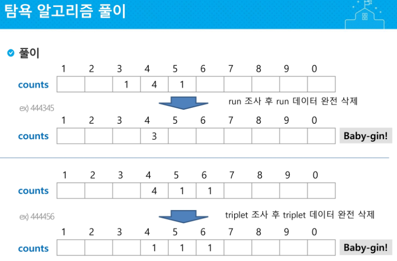
     - [1,2,3] => run
       [1,1,1] => triplet


#### (5) 정렬 ( Sort )

___

> - 2개 이상의 자료를 특정 기준에 의해 작은 값부터 큰 값( 오름차순 : ascending ),
>   혹은 그 반대의 순서대로 ( 내림차순 : descending ) 재배열하는 것
>   - **오름차순** Ascending [1, 2 , 3, 4, 5, 6, 7, 8, 9]
>   - 내림차순 Descending [10, 9, 8, 7, 6, 5, 4, 3, 2, 1]
>
> 
>
> -  키
>   - 자료를 정렬하는 기준이 되는 특정 값
>     - 서류를 번호대로 정렬하기
>     - 카드를 번호대로 정렬하기


- **정렬의 종류**

> 1. 대표적인 정렬 방식의 종류
>    - 버블 정렬 ( Bubble Sort )
>      - 인접한 두 개의 원소를 비교하며 자리를 계속 교환하는 방식
>    - 카운팅 정렬 ( Counting Sort )
>    - 선택 정렬 ( Selection Sort )
>    - **퀵 정렬 ( Quick Sort )**
>    - 삽입 정렬 ( Insertion Sort )
>    - **병합 정렬 ( Merge Sort )**


APS 과정을 통해 자료구조와 알고리즘을 학습하면서 다양한 형태의 정렬을 학습하게 된다.


- 버블 정렬 과정 ( 시간복잡도 O(n^2) )

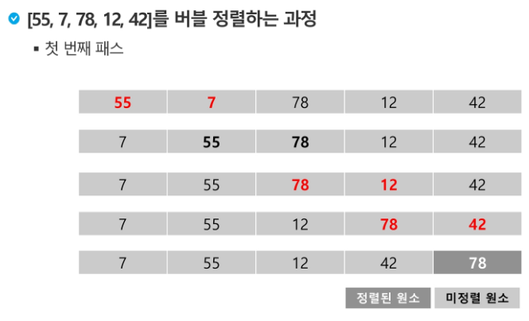

- 코드
  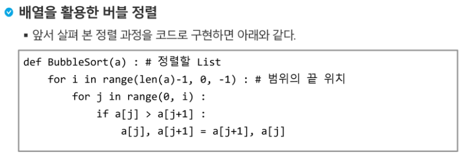

  인덱스를 활용해서 sorting 하는 간단한 방법....

