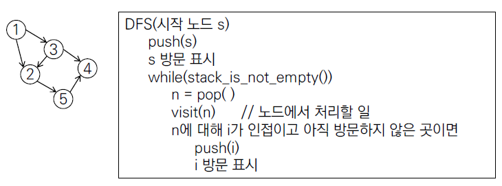

# Graph

> 2차원배열에 보통 저장을 한다.
>
> adj (인접)
>
> V개의 정점이 주어지면 정점은 1부터 시작하므로 V+1 개의 2차배열을 만들어야함


- ==인접행렬== ( 정점이 1000개 이하일때, )
  - 무방향 그래프
  - 방향 그래프
  - 가중치 그래프


- ==인접리스트== ( 노드가 1001개 이상일때 )


adj_list = [ [0], [2, 3] ]
1번 정점은 2, 3번 정점과 연결되어 있다.


- ==탐색== 
  - ==**깊이 우선 탐색(DFS)**==
    - ==Stack== 이용
    - 중복없이, 빠짐없이
    - 2개 이상 선택이 가능할 때, 정해진 순서에 따라 다음 노드 선택.
    - 더 이상 갈 수 없으면 가장 가까운 이전 갈림길에서 다른 방향 선택.
      - 지나온 경로 저장해야 함 (Stack)


- 재귀를 사용한 DFS
  - 재귀의 각 단계가 방문중인 노드 번호를 저장
  - 방문한 노드에서 방문하지 않은 인접 노드 중 번호가 작은 곳으로 이동.


- 반복을 사용한 DFS
  - 지나온 노드를 스택에 저장하거나, 방문하지 않고 남겨놓은 노드를 스택에 저장.




```python
import sys
sys.stdin = open('test.txt')

# 재귀 버전
def dfs1(n, V): # n번 노드에 방문
    visited[n] = 1
    print(n, end=' ')
    for i in range(1, V+1): # 노드가 0번째부터면 range 0 부터 시작
        if adj[n][i] == 1 and visited[i] == 0: # 노드 i가 n에 인접이고 방문 전이면
            dfs1(i, V) # i 노드로 이동

# 반복문 버전
def dfs2(n, V): 
    s = []
    s.append(n) # 시작점을 push()
    visited[n] = 1 # 스택에 저장됨
    while len(s) > 0: # 스택에 방문할 노드(갈림길)이 남아있지 않으면
        n = s.pop()
        print(n, end=' ')
        for i in range(1, V+1):
            if adj[n][i] == 1 and visited[i] == 0: # n번노드에서 갈 수 있는 노드 i
                s.append(i)
                visited[i] = 1

                
V, E = map(int, input().split())
edge = list(map(int, input().split()))
adj = [[0] * (V+1) for _ in range(V+1)] # 인접행렬
visited = [0] * (V+1)
for i in range(E):
    n1 = edge[i*2]
    n2 = edge[i*2+1]
    adj[n1][n2] = 1
    # adj[n2][n1] = 1 # 무방향그래프에서는 이 코드 추가 ( 양방향 가능 )


dfs1(1, V)
dfs2(1, V) # 방향그래프에서는 4에서 시작하면 4만 돌고끝나는데, 무방향에서는 다 돌게됨 시작점 상관X

'''
[입력]
5 6 # V, E
1 2 1 3 2 5 3 2 5 4 3 4

[출력]
1 2 5 4 3
'''
```


