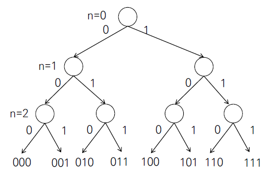

# 재귀 (recursion) 호출

### 1.재귀호출의 기본

- 특징
  - 자기 자신을 호출하지만 사용하는 메모리 영역이 구분되므로 다른 함수를 호출하는 것과 같음
  - 정해진 횟수만큼, 혹은 조건을 만족할 때 까지 호출을 반복함


- 정해진 횟수만큼 호출하기
  - 호출 횟수에 대한 정보는 인자로 전달
  - 정해진 횟수에 다다르면 호출 중단.


- ==**재귀함수의 구조**==
  - 재귀호출 단계마다 해야하는 작업 => 재귀 호출 부분.
    - recursive step (반복할 대상) (재귀스텝)
  - 재귀호출 완료 시 해야하는 작업 => 재귀 호출 종료 부분.
    - base_case (첫째항. 종료조건)

```python
def recursive(파라미터):
    # 탈출조건
	if 조건: 
        return 결과
    
    # 수행할 작업
    else:
        return recursive(작업된 인자)
```


- 재귀호출을 이용해 배열 복사하기
  - 호출 단계 n을 배열 인덱스로 활용
  - 배열의 크기와 호출 단계가 같아지면 (n==k) 재귀호출 중단, 배열 출력
  - 배열의 크기가 재귀 호출의 횟수를 결정

```python
A = [1,2,3] # 복사 대상
B = [1,2,3] # 복사 된후

def test(n, k):
    if n==k:
        print(Array)
        return None
    else:
        B[n] = A[n]
        test(n+1, k)
        
```


### 2.원하는 조건을 찾으면 중단하는 경우

- 주어진 집합에 V가 들어있으면 1, 없으면 0 을 리턴하는 재귀 호출.

```python
def find(n,k,v):
    if n==k:
        return 0
    elif a[n] == v:
        return 1
    else:
        return find(n+1, k, v)
```


- 리턴 값을 사용하는 재귀 호출
  - 팩토리얼 계산
    - 3! = 3x2x1 = 3 x 2!
    - f(n) = n * f(n-1) // n > 0
    - 0! = 1

```python
def factorial(n):
    if n <= 1:
        return 1
    else:
        return factorial(n-1) * n

a = factorial(3) #6
b = factorial(4) #24
print(a, b) # 6 24 
```


### 3.재귀 호출이 두번인 경우

- 배열 L의 각 자리에 0/1 이 오는 모든 경우 만들기.

```python
def f(n, k):
    if (n==k): # 부분집합 한 개 완성
        '''
        부분집합을 이용한 원하는 결과값을 리턴하는 코드 print(L)
        '''
        for i in range(k):
            if L[i] == 1:
                print(A[i], end=' ')
        print(L)
    else:
        L[n] = 0
        f(n+1, k)
        L[n] = 1
        f(n+1, k)
        

A = [1,2,3]
L = [0] * len(A)
f(0, len(A))
```


- 트리 형태로 표현




- 두 재귀호출의 리턴 값을 사용하는 경우
  - 피보나치 수열
    - f(n) = f(n-1) + f(n-2)
    - f(0) = 0, f(1) = 1

```python
def f(n):
    if n<2:
        return n
    else:
        return f(n-1) + f(n-2)
```


### 4. 순열 만들기 ( p24 )

> 호출횟수가 변하는 재귀호출

```python
def f(n, k):
	if n == k:
        
    else:
        for i in range(k): # used 를 왼쪽부터 탐색
            if u[i] == 0: # 이미 사용한 숫자가 아니라면
                u[i] = 1
                p[n] = A[i]
                f(n+1, k) # 다음 자리를 결정하러 이동
                u[i] = 0

A = [1,2,3]
p = [0] * len(A)
u = [0] * len(A)
f(0, len(A))
```


### 5. 분할 정복 기반의 알고리즘

> Divide & Conquer (p.249)

$$
C^8 = C*C*C*C*C*C*C*C
$$

$$
C^8 = C^4 * C^4
$$

```python
def power(Base, Exponent):
    if Exponent == 0 or Base == 0:
        return 1
    
    if Exponent % 2 == 0 : # 짝수면
        NewBase = Power(Base, Exponent/2)
        return NewBase * NewBase
    
    else:
        NewBase = Power(Base, (Exponent-1)/2)
        return (NewBase * NewBase) * Base
```


### 6. 퀵정렬

> 자바의 내부 sort 함수는 퀵소트로 되어있음

```python
def partition(a, begin, end):
    pivot = (begin + end) // 2
    L = begin
    R = end
    while L < R:
        while(a[L] < a[pivot] and L<R) : L += 1 # L 은 큰걸 찾음
        while(a[R] >= a[pivot] and L<R) : R -= 1 # R은 작은걸 찾음
        if L < R :
            if L == pivot :
                pivot = R
            a[L], a[R] = a[R], a[L]
    a[pivot], a[R] = a[R], a[pivot]
    return R

#재귀버전
def quickSort(a, begin, end):
    if begin < end :
        p = partition(a, begin, end)
        quickSort(a, begin, p-1)
        quickSort(a, p+1, end)
```


