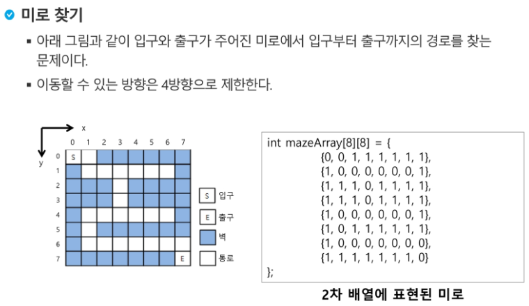

# Stack (2)

### 1.계산기 ( p.199 ~ 226 )

- 문자열로 된 계산식이 주어질 때, 스택을 이용하여 이 계산식의 값을 계산할 수 있다.
- 문자열 수식 계산의 일반적 방법
  - `중위 표기법`의 수식을 `후위 표기법`으로 변경한다. (스택이용)
  - 후위 표기법의 수식을 스택을 이용하여 계산한다.

```python
# 중위 표기법(infix notation)
 - 연산자를 피연산자의 가운데 표기하는 방법
 - 예) A + B
 
# 후위 표기법(postfix notation)
 - 연산자를 피연산자 뒤에 표기하는 방법
 - AB+
```


### 2.백트래킹 (Backtracking)

- 백트래킹(Backtracking) 기법은 해를 찾는 도중에 '막히면' (즉, 해가 아니면) 되돌아가서 다시 해를 찾아 가는 기법이다.
- 백트래킹 기법은 최적화 (optimization) 문제와 결정 (decision) 문제를 해결할 수 있다.
- 결정 문제 : 문제의 조건을 만족하는 해가 존재하는지의 여부를 'yes' 또는 'no'가 답하는 문제
  - 미로 찾기
  - n-Queen 문제
  - Map coloring
  - 부분 집합의 합 (subset Sum) 문제 등





```python
# <연습문제2>
# {1,2,3,4,5,6,7,8,9,10} 의 powerset 중 원소의 합이 10인 부분집합을 구하시오.

def f(n, k, s):
    if n == k:
        if s == 10:
            pass
    elif s > 10:
        return
    else:
        L[n] = 1
        f(n+1, k, s+A[n])
        L[n] = 0
        f(n+1, k, s)

```

