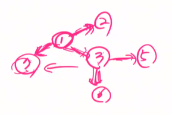

# BFS 알고리즘

> Queue 를 이용한 선입선출 형태
>
> 너비우선 탐색
>
> 거리우선탐색 

```python
def BFS(G, v): # G-그래프, v-정점
    visited = [0] * n # n : 정점의 개수
    queue = [] # 큐 생성
    queue.append(v) # 시작점 v를 큐에 삽입
    while queue: # 큐가 비어있지 않은 경우
        t = queue.pop(0) # 큐의 첫번째 원소 반환
        if not visited[t]: # 방문되지 않은 곳이라면
            visited[t] = True # 방문한 것으로 표시
            visit(t) # t 노드에 대해서 할일. (문제조건에 따라 달라짐)
        for i in G[t]: # t와 연결된 모든 선에 대해
            if not visited[i]: # 방문되지 않은 곳
                queue.append(i) # 큐에 넣기
            
```


## 그래프를 표현하는 방법

> - 인접행렬
> - 인접리스트


## BFS 그래프에만 사용하는가?

- 아니다
- 문자메시지 전달하는데 걸리는 시간
- 1번이 [2, 3, 7] 번에게 문자보내고 ( 1분걸림 )
- 3번이 [1, 5, 6] 에게 문자 보내고 ( +1분 추가 )



