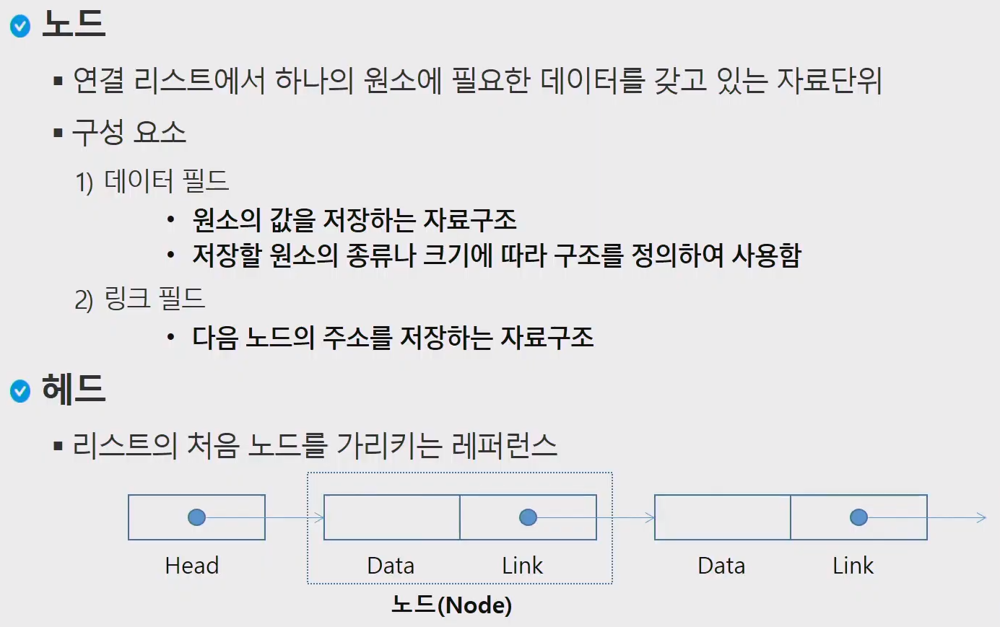

# 연결리스트 (Linked List)

## 1. 연결 리스트의 기본 구조



- 노드
  - Class 로 정의한다.


## 2. 종류

### - 단순 연결 리스트

1. 삽입(추가)


2. 삭제


3. **코드구현**

```python
class Node:
    def __init__(self, d=0 n=None):
        self.data = d
        self.next = n
        print(d, '생성')
        
    def __del__(self):
        print(self.data, '삭제')
        
#arr = []        
#for i in range(5):
#    arr.append(Node(i))    

class LinkedList:
    def __init__(self):
        self.head = None	# 첫 번째 노드
        self.size = 0		# 노드의 수
        
def printList(lst): # lst: LinkedList객체
    cur = lst.head
   
	while cur is not None:
        print(cur.data)
        cur = cur.next

mylist = LinkedList()

n5 = Node(5)
n4 = Node(4, n5)
n3 = Node(3, n4)
n2 = Node(2, n3)
n1 = Node(1, n2)
mylist.head = n1
mylist.size = 5

printList(mylist)
```


```python
class Node:
    def __init__(self, data=0, next=None):
        self.data = data
        self.next = next

def addList(data):
    global pHead
    if pHead == None:
        pHead = Node(data)
    else:
        pTemp = pHead
        
pHead = Node(10) # pHead: <__main__.Node object x~~>
print(pHead, pHead.data, pHead.next)
PHead.next = Node(20)


```


### - 이중 연결 리스트

1. 코드구현

```python
class Node:
    def __init__(self, d=0, p=None, n=None):
        self.data = d
        self.prev = p
        self.next = n

class LinkedList:
    def __init__(self):
        self.head = None
        self.tail = None
        self.size = 0

def addLast(lst, new): # 마지막에 추가
    if lst.head == None:
        lst.head = lst.tail = new
    else:
        new.prev = lst.tail
        lst.tail.next = new
        lst.tail = new
    lst.size += 1

def printList(lst):
    if lst.head == None:
        return 
    cur = lst.head
    while cur != None:
        print(cur.data, end=' ')
        cur = cur.next
    print()

    cur = lst.tail
    while cur != None:
        print(cur.data, end=' ')
        cur = cur.prev
    print()


mylist = LinkedList()

arr = [1, 3, 5, 7, 9]
for val in arr:
    addLast(mylist, Node(val))
printList(mylist)
```


### - 원형 연결 리스트


## 3. 장점

1. 메모리를 동적으로 사용할 수 있음
   - C언어와 같은자료에서는 정적으로 미리 배열의 크기를 정의해야함.


