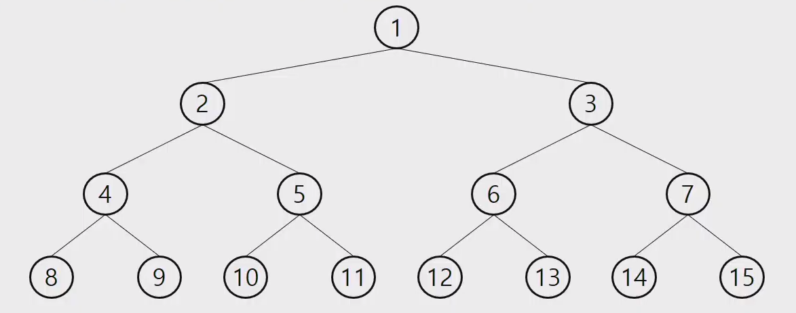
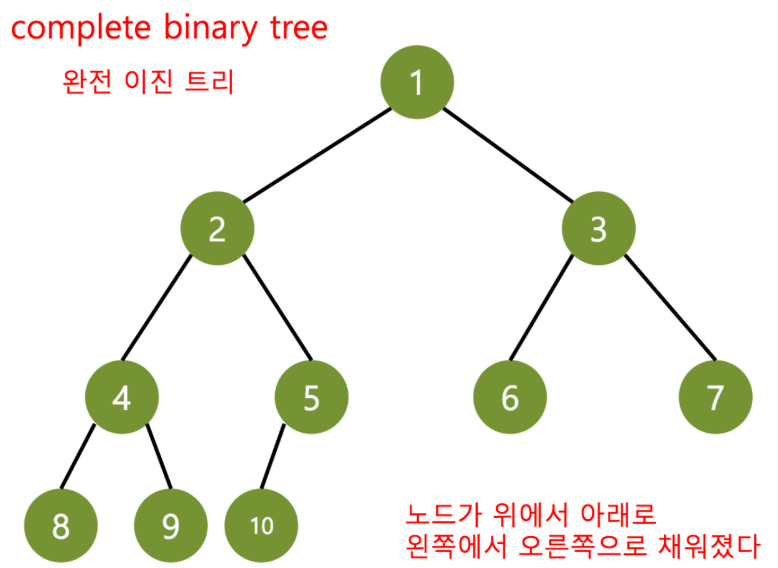
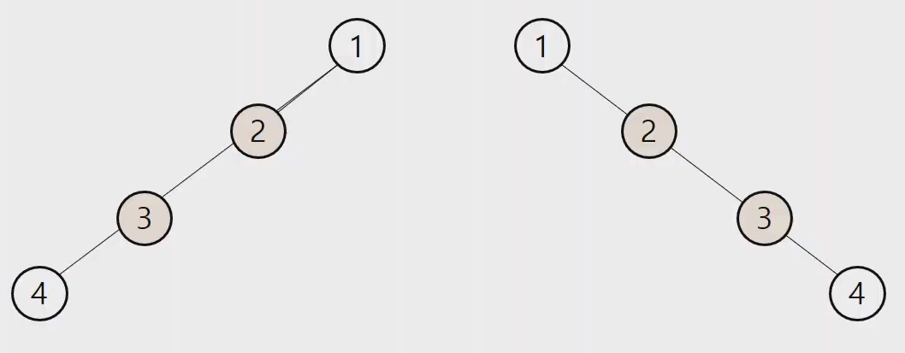
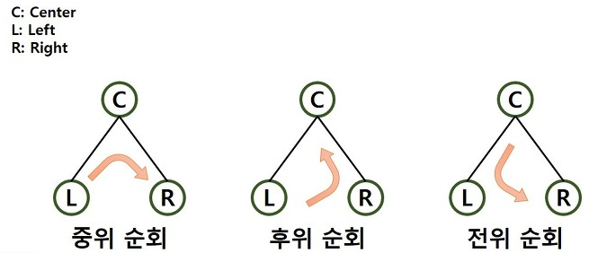
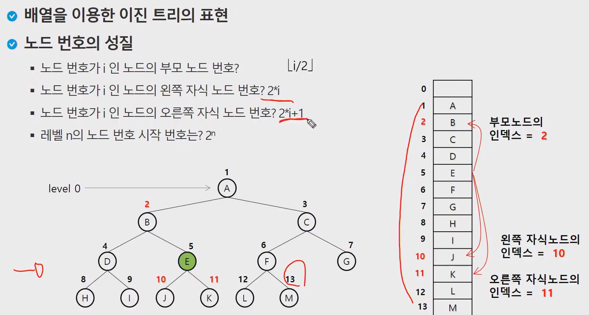
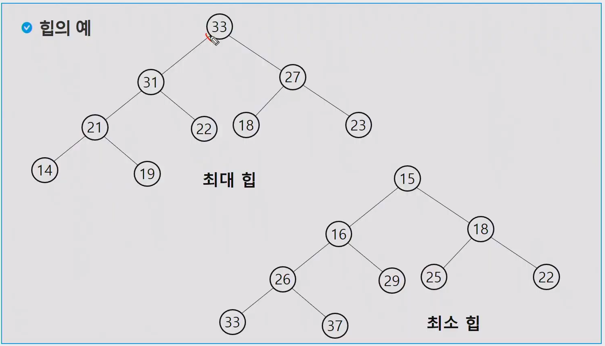
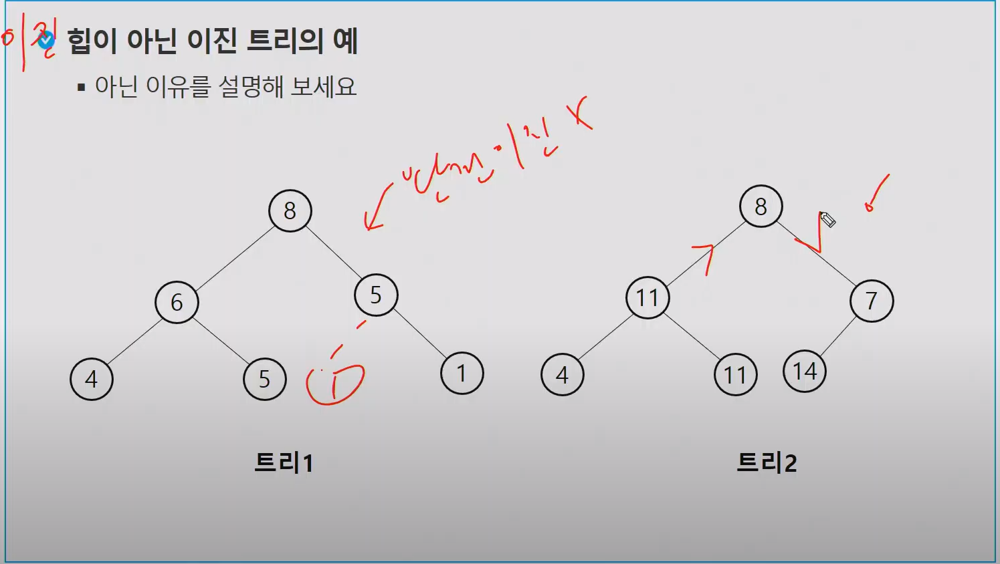

# 트리

## 이진트리

- 높이가 h인 이진 트리가 가질 수 있는 
  - 노드의 최소 개수 (h+1)개
  - 노드의 최대 개수 (2^h+1^-1) 개

### 포화 이진 트리 ( Full Binary Tree )

- 모든 레벨에 노드가 포화상태로 차 있는 이진 트리
- 높이가 h일 때, 최대의 노드 개수인 2^h+1^-1 개의 노드를 가진 이진트리
- 루트를 1번으로하여 2^h+1^-1 까지 정해진 위치에 대한 노드 번호를 가짐

### 완전 이진 트리 ( Complete Binary Tree )

- 높이가 h이고 노드 수가 n개일 때 (단 h+1 <= n < 2^h+1^-1), 포화 이진 트리의 노드 번호 1번부터
  n번까지 빈 자리가 없는 이진 트리
- 예) 노드가 10개인 완전 이진 트리

- `배열로 구현하기 좋다 ( 연결리스트보다 )`

### 편향 이진 트리 ( Skewed Binary Tree )

- 높이 h에 대한 최소 개수의 노드를 가지면서 한쪽 방향의 자식노드만을 가진 이진 트리
  - 왼쪽 편향 이진트리
  - 오른쪽 편향 이진트리
- 연결리스트와 같다.. ( 트리라고 주장은 하지만.. 구조자체는 사실 리스트 )

## 이진트리 - 순회(traversal)

- 순회란 트리의 각 노드를 중복되지 않게 전부 방문(visit) 하는 것을 말하는데,
  트리는 비 선형 구조이기 때문에 선형구조에서와 같이 선후 연결 관계를 알 수 없다.
- 따라서 특별한 방법이 필요하다.
  - `DFS`
  - BFS

- 순회 : 트리의 노드들을 체계적으로 방문하는 것
- `기본적인 순회 방법`
  - 전위순회 ( preorder traversal ) : VLR
    - 부모노드 방문 후, 자식노드를 좌,우 순서로 방문한다.
  - 중위순회 ( inorder traversal ) : LVR
    - 왼쪽 자식노드, 부모노드, 오른쪽 자식노드 순으로 방문한다.
  - 후위순위 ( postorder traversal ) : LRV
    - 자식 노드를 좌우 순서로 방문한후, 부모노드로 방문한다.

## 이진트리 순회

## 힙(heap)

- 힙이 아닌 이유

