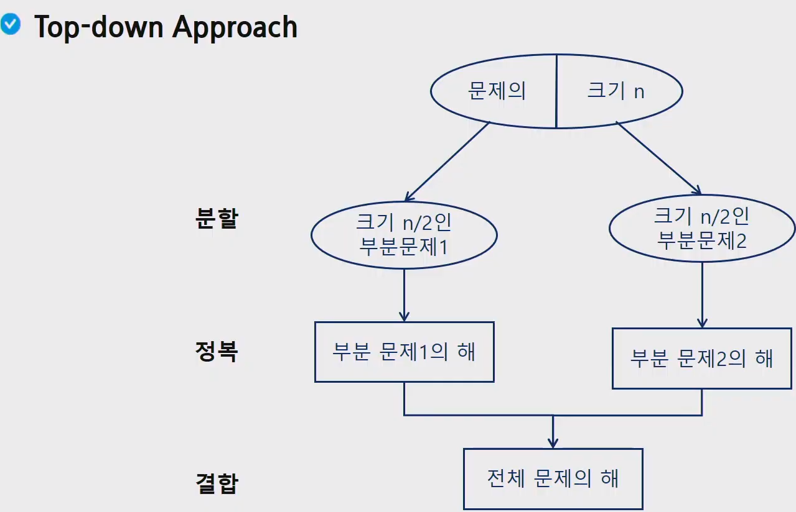
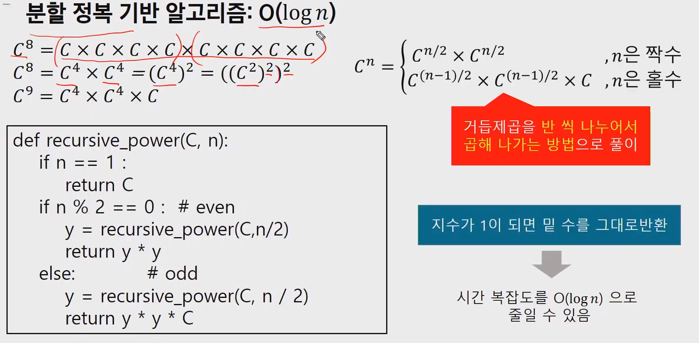
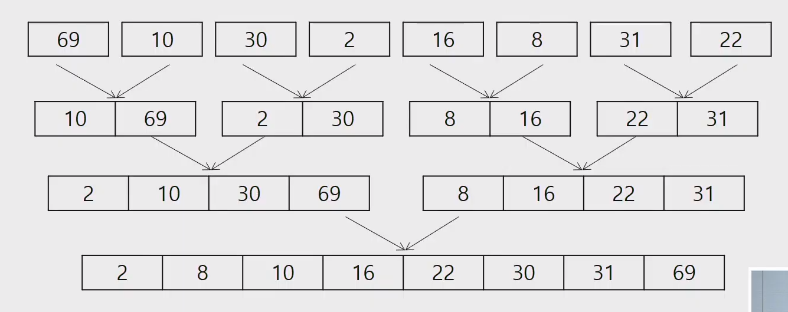
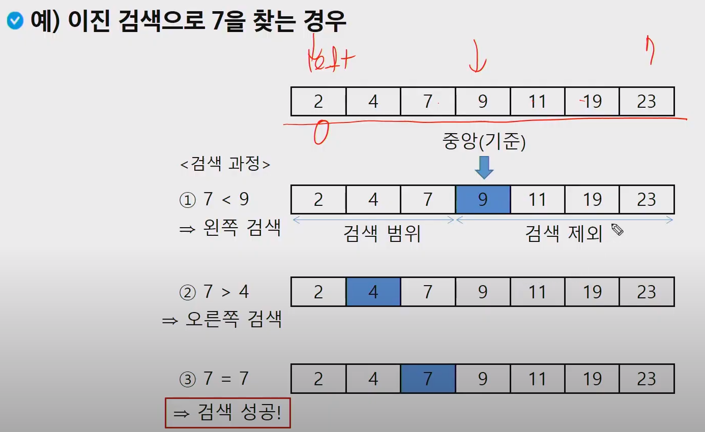

# 분할정복 & 백트래킹

> - 학습목표
>   - 문제를 분할해서 해결하는 `분할정복 (Divide and Conquer) 기법`을 이해하고
>     대표적인 알고리즘인 퀵 정렬과 병합 정렬에 대해 학습한다.
>   - 상태 공간 트리의 모든 노드를 검색하는 `백트래킹`에 대해 학습한다.
>   - `이진 트리` 의 특성을 이해하고 이진트리의 중요한 연산인 탐색, 삽입, 삭제 알고리즘을 학습한다.


## :one: ​분할정복

> 나폴레옹이 사용한 전략에서 유래
>
> - 설계전략
>   - 분할 (Divide) : 해결할 문제를 여러 개의 작은 부분으로 나눈다.
>   - 정복 (Conquer) : 나눈 작은 문제를 각각 해결한다.
>   - 통합 (Combine) : (필요하다면) 해결된 해답을 모은다.




### :cupid: 가짜 동전 찾기

- n개의 동전들 중에 가짜 동전이 하나 포함되어 있다. 가짜 동전은 진짜 동전에 비해 아주조금
  가볍다. 진짜 동전들의 무게가 동일하다고 할 때
- 양팔저울을 이용해서 가짜 동전을 찾아보자.
- 양팔 저울을 `최소로 사용`해서 가짜 동전을 찾는 방법은 무엇인가?
  예를 들어 동전이 24 (진짜23 가짜1) 개 있다면?


동전이 N개 -> N/2 개

n/2 * (n/2 + 1) / 2

`2^k <= n < 2^k+1`


### :cupid: 거듭제곱 문제

- C의 거듭제곱 = 1에 거듭제곱할 값만큼 C 를 곱하는방식으로연산수행

```
C^2 = C x C
C^3 = C x C x C
...
C^n = C x C x ... C

O(n)
```





```python
def recursive_power(C, n):
    if n == 1:
        return C
    if n % 2 == 0:
        y = recursive_power(C, n/2)
        return y * y
    else:
        y = recursive_power(C, n/2)
        return y * y * C
```


### :cupid: 병합 정렬 (Merge Sort)

- 여러 개의 정렬된 자료의 집합을 병합하여 한 개의 정렬된 집합으로 만드는 방식
- 분할 정복 알고리즘 활용
  - 자료를 최소 단위의 문제까지 나눈 후에 차례대로 정렬하여 최종 결과를 얻어냄
  - top-down 방식
- 시간 복잡도
  - O(n long n)




```python
def merge_sort(arr):
    # 문제를 절반으로 나누어서 각각을 해결하는 부분
    if len(arr) == 1:
        return arr
    # 절반으로 나누어서 각각 별도의 정렬 실행
    mid = len(arr) // 2
    left = arr[:mid]
    right = arr[mid:]

    left = merge_sort(left)
    right = merge_sort(right)

    return merge(left, right) # merge2(left, right)


def merge(arr1, arr2):
    # 두 개의 정렬된 부분집합을 하나의 부분집합으로 만들어 반환
    result = []

    # 병합과정 실행
    # 각각의 최소값들(가장 앞쪽 값)을 비교해서 더 작은 요소를
    # 결과에 추가
    # 두 부분집합에 요소가 없어질때 까지 계속 반복
    while arr1 or arr2:
        if len(arr1) > 0 and len(arr2) > 0:
            if arr1[0] <= arr2[0]:
                result.append(arr1.pop(0))
            else:
                result.append(arr2.pop(0))
        elif len(arr1) > 0:
            result.append(arr1.pop(0))
        elif len(arr2) > 0:
            result.append(arr2.pop(0))

    return result


# 인덱스 이동하면서 병합하는 함수 ( 파이썬외에 언어에서 도움 됨 )
def merge2(arr1, arr2):
    result = []
    i = j = 0
    while i < len(arr1) or j < len(arr2):
        if i < len(arr1) and j < len(arr2):
            if arr1[i] <= arr2[j]:
                result.append(arr1[i])
                i += 1
            else:
                result.append(arr2[j])
                j += 1
        elif i < len(arr1):
            result.append(arr1[i])
            i += 1
        elif j < len(arr2):
            result.append(arr2[j])
            j += 1

    return result


# 정렬이 안된 배열
arr = [5,2,4,1,7,8,9,6,3]
res = merge_sort(arr)
print(res)
```


### :cupid: [퀵정렬 (Quick Sort)](https://ldgeao99.tistory.com/376)

> - 병합정렬 처럼 두 부분으로 쪼개어지는 것은 동일하나 Pivot item이 존재하여 이를 기준으로 나뉘어진다.
> -   이를 기준으로 나눌 때 이보다 작은 것은 왼편, 큰 것은 오른편에 위치시키게 된다.
>     또한, 병합정렬과 다르게 병합과정이 존재하지 않는다.
>
> - 분할 알고리즘을 무엇으로 사용하느냐, 그리고 피봇값을 무엇으로 하느냐에 따라 효율이 크게 달라진다.
> - Top-down 방식으로(재귀) 구현됨
> - 평균 시간복잡도는 O(nlogn), 최악의 경우 O(N^2)

**Hoare Partition 알고리즘을 이용한 퀵정렬**

```python
# 퀵 정렬
def quick_sort(arr, left, right): # 왼쪽 시작점, 오른쪽 끝지점
    # pivot 위치 결정 ( 피봇을 기준으로 큰 값은 오른쪽, 작은 값은 왼쪽으로 )
    # 왼쪽 부분집합 정렬
    # 오른쪽 부분집합 정렬
    if left < right:
        # 피봇 구하기
        pivot = hoare_partition(arr, left, right)
        # 왼쪽 부분집합 정렬 실행
        quick_sort(arr, left, pivot-1)
        # 오른쪽 부분집합 정렬 실행
        quick_sort(arr, pivot+1, right)


# 피봇 결정
def hoare_partition(arr, left, right):
    # i, j 를 설정하고, 큰값 찾고, 작은값 찾아서 위치 바꿔주기
    i = left
    j = right
    pivot = arr[left]

    # i가 j 보다 작을 때 까지 계속해서 반복
    while i <= j :
        # 피봇 보다 큰값이 나올 때 까지 i 증가
        while i <= j and arr[i] <= pivot:
            i += 1
        # 피봇 보다 작은 값이 나올 때 까지 j 감소
        while i <= j and arr[j] >= pivot:
            j -= 1

        # i 가 j 보다 작으면, 위치 교환
        if i < j :
            arr[i], arr[j] = arr[j], arr[i]
    arr[left], arr[j] = arr[j], arr[left]

    return j # 피봇의 위치


# 코드 테스트
# 호어 파티션을 이용한 Quick Sort
arr = [4, 5, 1, 2, 9, 8, 3, 6, 7]
quick_sort(arr, 0, len(arr)-1)
print(arr)
```


### :cupid: 이진 검색 (Binary Search)

> - 자료의 가운데에 있는 항목의 키 값과 비교하여 다음 검색의 위치를 결정하고 검색을 계속
>   진행하는 방법
>   - 목적 키를 찾을 때까지 이진 검색을 순차적으로 반복 수행함으로써 검색 범위를 반으로 줄여가면서 보다 빠르게 검색을 수행함
>
> 
>
> - 이진 검색을 하기 위해서는 자료가 `정렬된 상태`이어야 한다.


- 검색 과정 (순서)
  1. 자료의 중앙에 있는 원소를 고른다.
  2. 중앙 원소의 값과 찾고자 하는 목표 값을 비교한다.
  3. 목표 값이 중앙 원소 값보다 작으면 자료의 왼쪽 반에 대해서 새로 검색을 수행하고,
     크다면 자료의 오른쪽 반에 대해서 새로 검색을 수행 한다.
  4. 찾고자 하는 값을 찾을 때 까지 1~3 과정을 반복한다.




```python
# 반복구조
def binarySearch(n, arr, key):
    low = 0
    high = n - 1
    
    while low <= high and location = 0:
        mid = low + (high -low) // 2
        
        if arr[mid] == key:
            return mid
        elif arr[mid] > key:
            high = mid - 1
        else:
            low = mid + 1
    return -1            
            
# 재귀 구조
def binarySearch(arr, low, high, key):
    if low > high:
        return -1
    
    else:
        mid = (low + high) // 2
        if key == arr[mid]:
            return mid
        elif key < arr[mid]:
            return binarySearch(arr, low, mid - 1, key)
        else:
            return binarySearch(arr, mid + 1, high, key)
```

