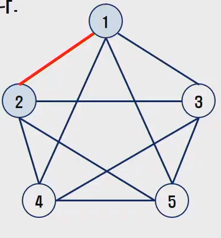
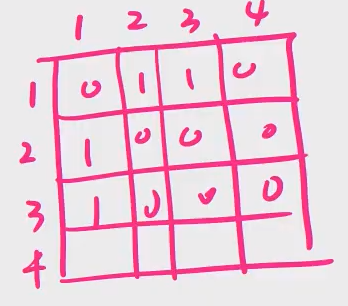
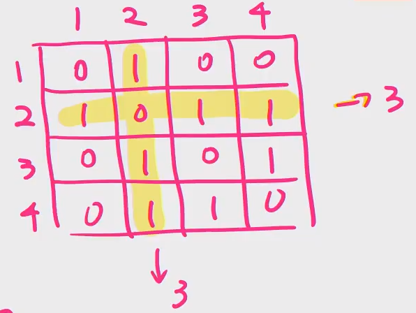
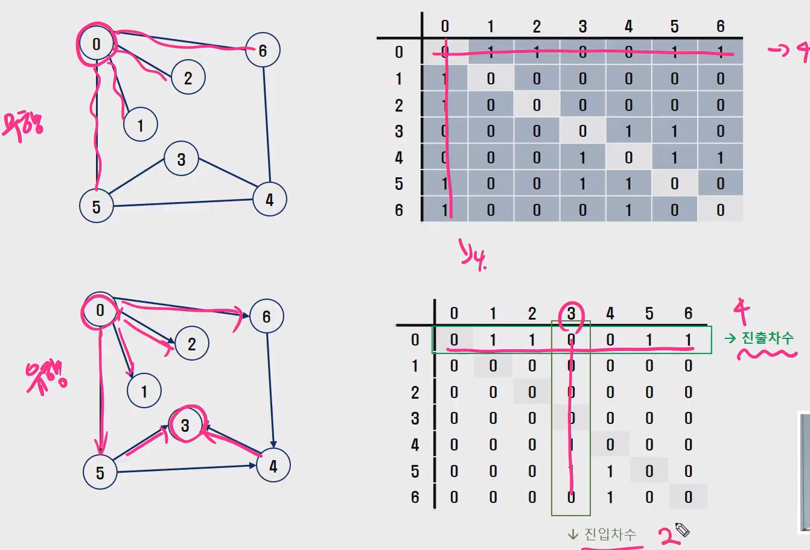
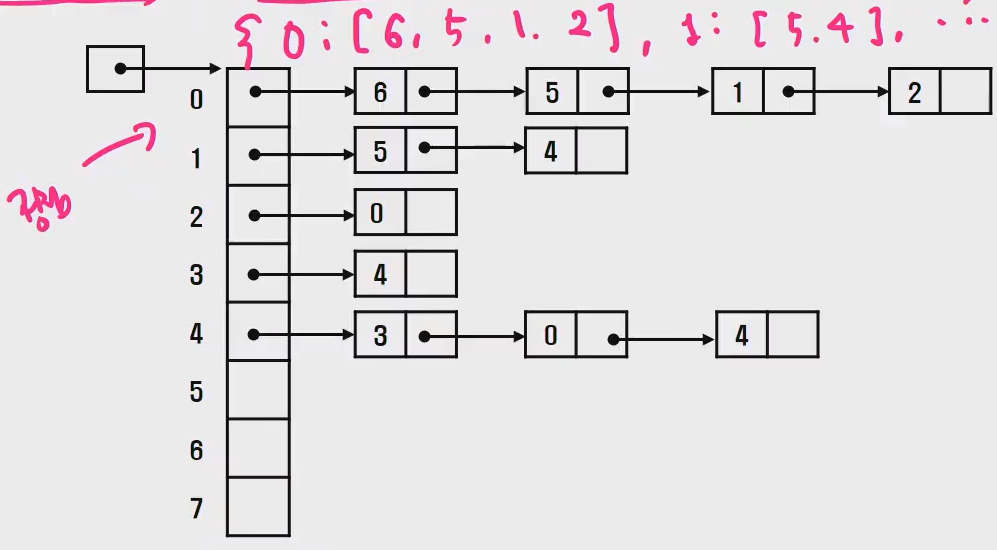
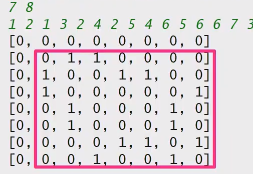
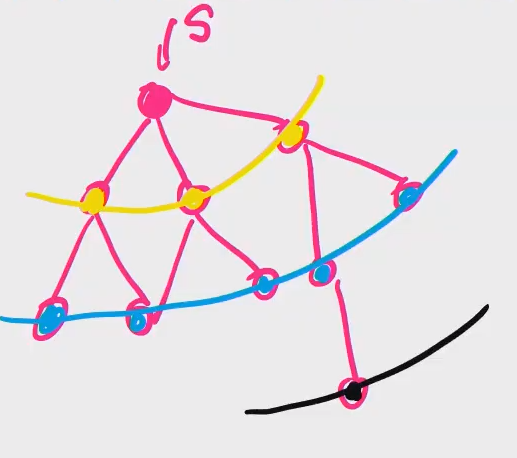
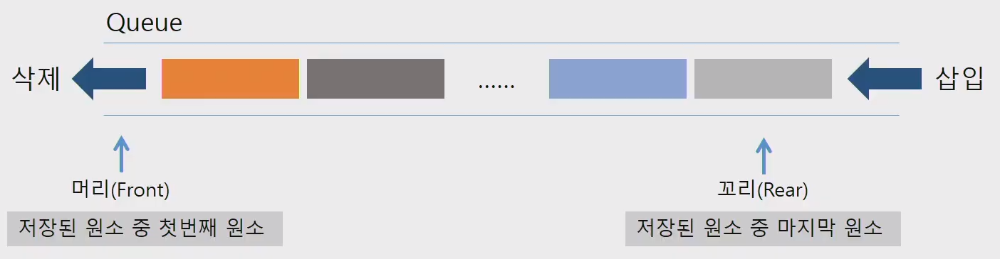
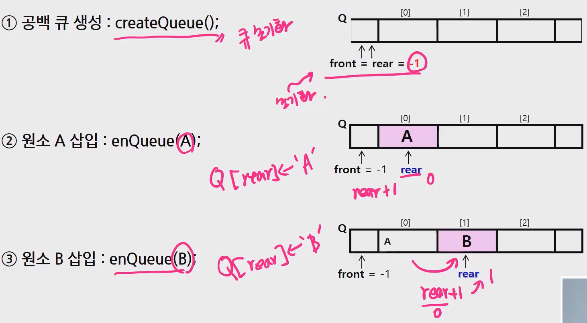
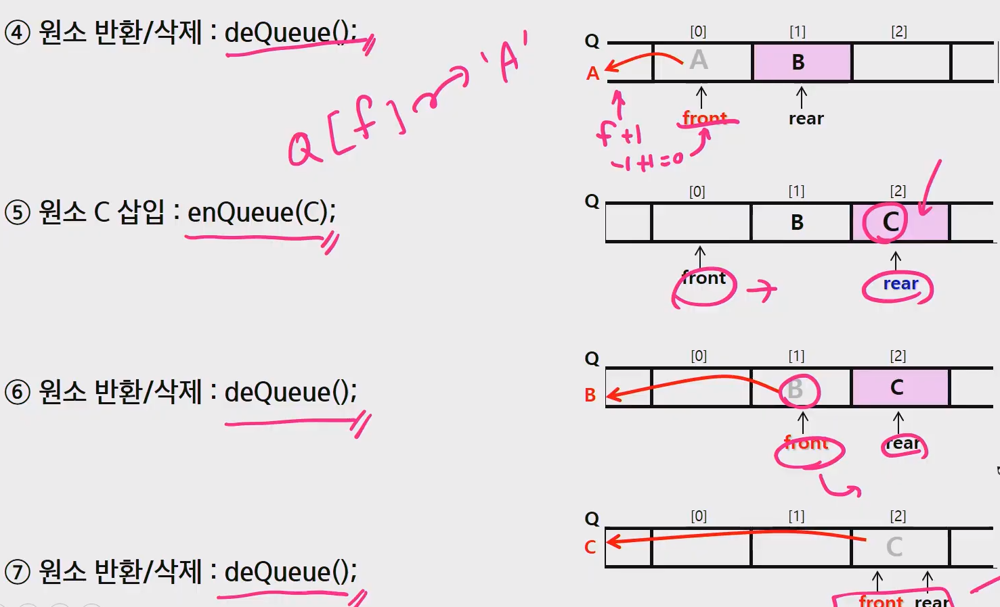

# 그래프

> 학습목표 
>
> - 그래프 탐색 기법인 DFS, BFS 기법을 학습한다.
> - 그래프 알고리즘에 활용되는 상호배타 집합(Disjoint-Sets)의 자료구조 학습
> - 최소 신장 트리 (MST) 이해하고, **탐욕기법을 이용하여 그래프에서 MST 찾는 알고리즘 학습**
> - **그래프의 두 정점 사이의 최단경로 찾는 방법**


## :one: 특징

> - 그래프는 아이템들과 이들 사이의 연결 관계를 표현한다.
>
> - 그래프는 정점(Vertex)들의 집합과 이들을 연결하는 간선(Edge)들의 집합으로 구성된 자료구조
>   - V : 정점의 개수, E : 그래프에 포함된 간선의 개수
>   - V개의 정점을 가지는 그래프는 최대 V(V-1) /2 간선이 가능
>     - 예) 5개 정점이 있는 그래프의 최대 간선 수 10 ( 5*4 / 2 )
> - 선형 자료구조나 트리 자료구조로 표현하기 어려운 N:N 관계를 가지는
>   원소들을 표현하기에 용이하다.
>   - 선형 자료구조
>     - 리스트, 배열, ...


## :two: 그래프의 유형

> - 무향 그래프 (Undirected Graph)
> - 유향 그래프 (Directed Graph)
> - 가중치 그래프 (Weighted Graph)
> - 사이클 없는 방향 그래프 (DAG, Directed Acyclic Graph)
>   - 시작 정점과 끝정점이 같은 단순경로

- 완전 그래프
  - 정점들에 대해 가능한 모든 간선들을 가진 그래프
- 부분 그래프
  - 원래 그래프에서 일부의 정점이나 간선을 제외한 그래프 (Sub)


- 인접(**Adj**acency)
  - 두 개의 정점에 간선이 존재(연결)하면 서로 인접해 있다고 한다.
  - 완전 그래프에 속한 임의의 두 정점들을 모두 인접해있다.




**:cupid: 그래프 경로**

- 경로란 간선들을 순서대로 나열한 것
  - 간선들 (0, 2), (2, 4), (4, 6)
  - 정점들: 0 2 4 6
- 경로 중 한 정점을 최대한 한번만 지나는 경로를 **단순경로**라 한다.
  - 0 - 2 - 4 - 6, 0 - 1 - 6
- 시작한 정점에서 끝나는 경로를 **사이클(Cycle)** 이라고 한다.
  - 1 - 3 - 5 - 1


**:cupid: 그래프 표현**

- 간선의 정보를 저장하는 방식, 메모리나 성능을 고려해서 결정


- **인접행렬** (**Adj**acent Matrix)
  - |V| x |V| 크기의 2차원 배열을 이용해서 간선 정보를 저장
  - 배열의 배열 (포인터 배열)




- **인접 리스트 (Adjacent List)**

  - 각 정점마다 해당 정점으로 나가는 간선의 정보를 저장

  

- 간선의 배열

  - 간선(시작 정점, 끝 정점)을 배열에 연속적으로 저장


## :three: 인접행렬

> - 두 정점을 연결하는 간선의 유무를 행렬로 표현
>   - |V| x |V| 정방 행렬
>   - 행 번호와 열 번호는 그래프의 정점에 대응
>   - 두 정점이 인접되어 있으면 1, 그렇지 않으면 0

- 무향 그래프
  - i 번째 행의 합 = i 번째 열의 합 = Vi 의 차수
  - 1번이 2번과 연결되어 있다면, 2번도 1번과 연결되어있다 (무향)




- 유향 그래프
  - 행 i 의 합 = Vi 의 진출 차수
  - 열 i 의 합 = Vi 의 진입 차수


**:cupid: 정리**




**:cupid: 인접행렬의 단점**

- |V| : 7 
  - 정점이 7개 => 7 x 7 행렬 (49)
    - V 가 커질수록 메모리를 많이 사용
  - 간선이 8개
  - 8 / 49 


- 간선이 적더라도.. (희소그래프)
- 인접정점을 찾을 때, 인접정점이 적더라도
  - V번 연산필요 ( 시간복잡도가 올라간다 )


## :four: 인접 리스트

> - 각 정점에 대한 인접 정점들을 순차적으로 표현
> - 하나의 정점에 대한 인접 정점들을 각각 노드로 하는 연결 리스트로 저장
>
> 

- 차수
  - 0번에 연결되있는게 4개의 노드라면, 차수는 4


## :five: 문제 제시

**문제 제시: 친구관계**

- A의 친구는 B다.
- C 의 친구는 E,F 이다.
- (D-E), (F-G), (N-B, I, L)


- A의 친구 중에 친구가 가장 많은 친구는 누구인가?


**문제 제시: 친구관계2**

- 다음과 같이 친구 관계를 그래프로 표현하였다.


- A로부터 시작해서 한명의 친구에게만 소식을 전달, 
  전달 할 수 있다면 최대 몇명의 친구가 소식을 전달 받을 수 있을까?
  (소식을 전달 받은 친구한테는 재전달 X)
  - **DFS**


- A로부터 시작해서 친구들에게 동시에 소식을 전달할 수 있다고 할 때, 가장 늦게 전달 받은 사람
  은 누구인가? ( 단 친구들에게 소식을 전달하는 속도는 동일하다.)
  - **BFS**


## **:six: 그래프 순회(탐색)**

- 그래프 순회는 비선형구조인 그래프로 표현된 모든 자료(정점)를 빠짐없이 탐색
- 두가지 방법
  - DFS (깊이 우선 탐색)
  - BFS (너비 우선 탐색)


**:cupid: DFS(깊이 우선 탐색)**

- 시작 정점의 한 방향으로 갈 수 있는 경로가 있는곳 까지 깊이 탐색해 가다가
  더 이상 갈 곳이 없게되면, 가장 마지막에 만났던 갈림길 간선이 있는 정점으로 되돌아와서
  다른 방향의 정점으로 계속 반복하여 결국 모든 정점을 방문하는 순회방법


- 가장 마지막에 만났던 갈림길의 정점으로 되돌아가서 다시 깊이 우선 탐색을 반복해야 하므로
  **후입선출 구조의 스택 사용**


**스택(Sack)의 특성**

- 물건을 쌓아 올리듯 자료를 쌓아 올린 형태의 **자료구조**이다.
- 선형구조 : 자료 간의 관계가 1대1 관계를 갖는다.
  - 비선형구조 : 자료 간의 관계가 1대N 의 관계를 갖는다. (예: 트리)
- 마지막에 삽입한 자료를 가장 먼저 꺼낸다.
  - 후입선출 (LIFO, Last-In-First-Out) 이라고 부른다.


**스택의 구현**

- 스택을 구현하기 위해서는 필요한 저장소와 연산
  - 자료를 선형으로 저장할 저장소 => [리스트, 배열]
    - C 언어에서는 배열
    - 저장소 자체를 스택이라 부르기도 함
    - 스택에서 마지막 삽입된 원소의 위치를 Top 이라 부른다.
  - 연산
    - Push
      - 저장소에 자료 삽입
    - pop
      - 저장소에 자료꺼낸다. (Top 을 꺼내게 됨)
    - isEmpty
      - 스택이 공백인지 아닌지 확인
    - peek
      - 스택의 Top 에 있는 item 반환


**스택의 삽입/삭제 과정**

- 빈 스택에 원소 A, B, C 를 차례로 삽입 후 한번 삭제하는 연산 과정

- 스택의 Push 알고리즘

```python
def push(s, x):
    top = top + 1
    
    # top 이 스택길이보다 크면 에러
    if top > len(s):
        return 'overflow'
    else:
        s[top] = x
```

- 스택의 Pop 알고리즘

```python
def pop(s):
    if top == 0:
        return 'underflow'
    else:
        top = top - 1
        return S[top+1]
```


## :seven: DFS

> 


**:cupid: DFS 알고리즘 - 재귀**

```python
'''
dfs + 재귀
입력
7 8
1 2 1 3 2 4 2 5 4 6 5 6 6 7 3 7

출력
1 2 4 6 5 7 3
'''
import sys
sys.stdin = open('input.txt')

def dfs_recursive(v):
    visited[v] = 1
    print(v, end=' ')
    for i in range(1, V+1):
        if adj_Matrix[v][i] == 1 and visited[i] == 0:
            dfs_recursive(i)

# 입력 받기
V, E = map(int, input().split())
edges = list(map(int, input().split()))

# 인접행렬로 표현
adj_Matrix = [[0] * (V+1) for _ in range(V+1)] # 정점+1 만큼 2차배열 만듦
for i in range(E):
    start, end = edges[2 * i], edges[2 * i + 1]
    # 무향 그래프
    adj_Matrix[start][end] = 1
    adj_Matrix[end][start] = 1

# 그래프 확인하기
for row in adj_Matrix:
    print(row)

# 방문 여부 확인 배열
visited = [0] * (V+1)

# 함수 실행
dfs_recursive(1)
```


**:cupid: DFS 알고리즘 - 반복**

```python
'''
dfs + 반복
입력
7 8
1 2 1 3 2 4 2 5 4 6 5 6 6 7 3 7

출력
1 2 4 6 5 7 3
'''

import sys
sys.stdin = open('input.txt')

def dfs_stack(v):
    stack = []
    visited = [0] * (V+1)
    stack.append(v)
    while stack:
        s = stack.pop()
        if not visited[s]:
            print(s, end=' ')
            visited[s] = 1

            for i in range(1, V+1):
                if adj_Matrix[s][i] == 1 and not visited[i]:
                    stack.append(i)


V, E = map(int, input().split())
edges = list(map(int, input().split()))

# 인접행렬로 표현
adj_Matrix = [[0] * (V+1) for _ in range(V+1)] # 정점+1 만큼 2차배열 만듦(idx편하게)
for i in range(E):
    start, end = edges[2 * i], edges[2 * i + 1]
    # 무향 그래프
    adj_Matrix[start][end] = 1
    adj_Matrix[end][start] = 1

dfs_stack(1)
```


## :eight: BFS

> - 너비 우선 탐색
>
> - [참고문서](acmicpc.net/promlem/1697) => 라이브러리 collections 의 deque 사용하기
>   - 속도가 일반 배열(리스트) 보다 빠르다.
> - 시작점의 인접한 정점들을 먼저 모두 차례로 방문한 후에,
>   방문했던 시작점으로 하여 다시 인접한 정점들을 차례로 방문하는 방식
> - 인접한 정점들에 대해 탐색을 한 후, 차례로 다시 너비우선탐색을 진행해야 하므로,
>   **선입선출 형태의 자료구조인 큐** 를 활용한다.




**:cupid: 큐의 특징**

- 스택과 마찬가지로 삽입과 삭제의 위치가 제한적인 자료구조
  - 큐의 뒤에서는 삽입만,
    큐의 앞에서는 삭제만 이루어지는 구조.
- **큐**에 삽입한 순서대로 원소가 저장되어 , 가장 먼저 삽입된 원소는 가장 먼저 삭제된다.
  - 선입선출구조 (FIFO : First In First Out)
- **python 에서는 collections 의 deque 라이브러리를 사용하는것이 속도면에서 더 빠르다.**



- 큐의 기본 연산

  - 삽입: enQueue

    

    - rear = rear + 1
    - Queue[rear] = value

  

  - 삭제: deQueue

    

    - front = front + 1
    - return `Queue[front]`

    

  - front == rear 가 같으면 Queue 가 비어있다.


**:cupid: 큐의 구현**

- 삽입: enQueue(item)
  - 마지막 원소 뒤에 새로운 원소를 삽입
    - rear 값을 하나 증가시켜 새로운 원소 삽입할 자리 마련
    - 그 인덱스에 해당하는 배열원소 Q[rear] 에 item 저장

```python
def enQueue(Q):
    if isEmpty():
        queue_empty # front == rear 같을 때,
    else:
        rear += 1
        Q[rear] = item
```


- 삭제: deQueue(item)
  - 가장 앞에 있는 원소를 삭제
    - front 값 하나 증가시켜, 큐에 남아있게 될 첫번째 원소 이동
    - 새로운 첫번째 원소를 리턴함으로써 삭제와 동일한 기능

```python
def deQueue(Q):
    if isEmpty():
        queue_empty # front == rear 같을 때,
    else:
        front += 1
        return Q[front]
```


- 공백상태 및 포화상태 검사: `isEmpty(), isFull()`
  - 공백상태: front == rear
  - 포화상태: rear = n - 1 `(n: 배열의크기, n-1: 배열의 마지막 인덱스)`

```python
def isEmpty():
    if front == rear:
        return True
    else:
        return False
    
def isFull():
    if rear == n-1:
        return True
    else:
        False
```


**:cupid: BFS 슈도 코드**

```python
def BFS(G, v): # 그래프G, [인접행렬, 인접리스트] // 탐색시작점 v
    queue = [v] # 큐생성, 시작점 큐에 삽입
    visited[v] = 1 # 방문했다고 표시
    
    while queue: # 큐가 비어있지 않으면 반복
        t = queue.pop(0)
        for node in G[t]:
            if not visited[node]:
                queue.append(node)
                visited[node] = 1
    
```


**:cupid: 문제**

**[SWEA 6일차 연산 문제](https://swexpertacademy.com/main/learn/course/subjectDetail.do?courseId=AVuPDYSqAAbw5UW6&subjectId=AWUYG3y62EcDFAVT)**

```python
from collections import deque

def bfs(start, goal):
    visited = [0] * 1000001
    queue = deque()
    queue.append(start)

    while queue:
        t = queue.popleft()
        if t == goal:
            return visited[goal]
        a = t + 1
        b = t - 1
        c = t * 2
        d = t - 10

        for i in [a, b, c, d]:
            if 1 <= i <= 1000000 and not visited[i]:
                queue.append(i)
                visited[i] = visited[t] + 1

T = int(input())
for tc in range(1, T+1):
    N, M = map(int, input().split()) # 2, 7
    result = bfs(N, M)
    print(f'#{tc} {result}')
```

