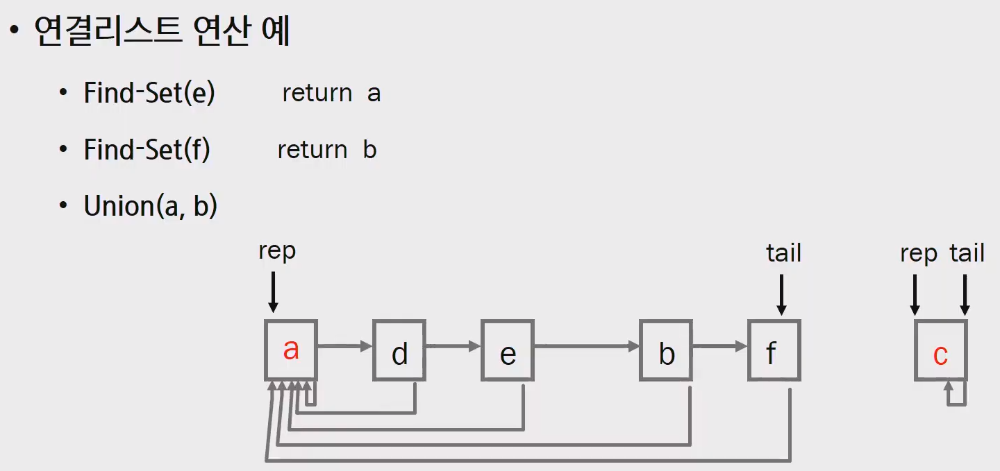

# 서로소 집합 (Disjoint-Sets)

> - 서로소 또는 상호배타 집합들을 서로 중복 포함된 원소가 없는 집합들이다. 
>   다시 말해 교집합이 없다.
> - 집합에 속한 하나의 특정 멤버를 통해 각 집합들을 구분한다.
>   **이를 대표자(representative)라 한다.**
> - 상호배타 집합을 표현하는 방법
>   - 연결 리스트
>   - 트리
> - 상호배타 집합 연산
>   - Make-Set(x)
>     - 원소x 를 유일한 원소로 하는 집합을 생성
>     - Make-Set(1) => { 1 }
>   - Find-Set(x)
>     - Find-Set(3) => { 3 이 포함된 집합의 대표자 리턴 }
>     - **x가 속한 집합의 대표자 를 리턴한다.**
>   - Uninon(x, y)
>     - x집합, y집합 을 합친다.
> - **하나의 자료구조이다.**


## :one: 상호 배타 집합 표현 - 연결리스트

> - 같은 집합의 원소들은 하나의 연결리스트로 관리한다.
> - 연결리스트의 맨 앞의 원소를 집합의 **대표 원소**로 삼는다.
> - 각 원소는 집합의 대표원소를 가리키는 링크를 갖는다.


**:cupid: 연결리스트 연산**

- Find-Set(a) | return a
- Find-Set(f) | return b
- Union(a, b)




## :two: 상호 배타 집합 표현 - 트리

> - 하나의 집합을 하나의 트리로 표현한다.
> - 자식 노드가 부모 노드를 가리키며 **루트 노드가 대표자**가 된다.


- 연산 예


## :three: 문제점

> - 대표자를 찾기 위해 `재귀호출` 을 여러번 실행한다.


**:cupid: 해결**

**대표자를 바로 찾을 수 있게 만들기**

- 연산의 효율을 높이는 방법

  - Rank를 이용한 Union
    - 각 노드는 자신을 루트로 하는 subtree의 랭크Rank라는 이름으로 저장한다.
    - 두 집합을 합칠 때, rank가 낮은 집합을 rank가 높은 집합에 붙인다.

  

  

  - Path compression
    - Find-Set 의 과정에서 만나는 노드 들이 직접 root 를 가리키도록 포인터를 바꾸어 준다.
    - root : 대표자
    - 포인터한다.. => 갱신한다.


## :four: 문제풀이

> - 현재 완성된 코드는 rank 와 Path compression 을 통해 연산속도가 개선된 결과이다.
> - 연산속도를 개선하지 않은 코드를 사용하면 대표자를 찾기위해 
>   많은 재귀함수를 호출하게 되므로, 메모리를 더 사용하고 시간이 오래걸리게 된다.


```python
def make_set(x):
    p[x] = x

    
def find_set(x):
    if p[x] == x:
        return x
    else:
        p[x] = find_set(p[x]) # 갱신하기
        return p[x]

    
def union(x, y):
    px = find_set(x)
    py = find_set(y)
    # rank 이용해서 조건 주기
    if rank[px] > rank[py]:
        p[py] = px
    else:
        p[px] = py
        if rank[px] == rank[py]:
            rank[py] += 1


N = 8
p = [0] * (N+1)
rank = [0] * (N+1)

for i in range(1, N+1):
    make_set(i)

union(1, 3)
union(2, 3)
union(5, 6)
union(6, 8)
union(1, 5)
union(6, 7)

print(p)
print(find_set(4))
print(find_set(5))
```

