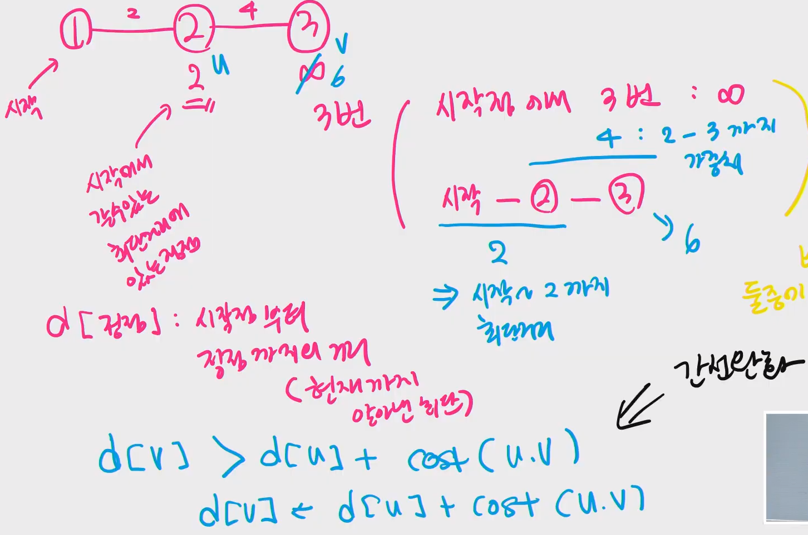

# 최단 경로

> - 알고리즘
>   - **다익스트라**
>   - 벨만포드
>   - 플로이드워샬


- 최단 경로 정의
  - 간선의 가중치가 있는 그래프에서 두 정점 사이의 경로들 중에 간선의 가중치의 합이 최소인 경로


- 하나의 시작 정점에서 끝 정점까지의 최단경로 ( one to all )
  - **다익스트라 (dijcstra) 알고리즘**
    - 음의 가중치를 허용하지 않음
  - 벨만-포드 (Bellman-Ford) 알고리즘
    - 음의 가중치 허용


- 모든 정점들에 대한 최단 경로 ( all pair )
  - 플로이드-워샬(Floyd-Warshall) 알고리즘


## :one: Dijkstra 알고리즘

> - 시작 정점에서 거리가 최소인 정점을 선택해 나가면서 최단 경로를 구하는 방식
> - 시작정점(s) 에서 끝정점(t) 까지의 최단 경로에 정점 x 가 존재한다.
>   이때, 최단경로는 s 에서 x까지의 최단 경로와 x에서 t까지의 최단경로로 구성된다.
> - 탐욕 기법을 사용한 알고리즘으로 **MST의 프림 알고리즘과 유사**하다.


**:cupid: 간선완화 **

- d[정점] : 시작점부터 정점까지의 거리 ( 현재까지 알아낸 최단 )

- `d[v] > d[u] + cost(u, v)` 이면 **갱신**




**:cupid: 수도코드**

```python
# s: 시작 정점,
# A: 인접 행렬,
# D: 거리,
# v: 정점 집합,
# U: 선택된 정점 집합

def Dijkstra(s, A, D):
    U = {s}
    
    for v in V:
        D[v] = A[s][v]
     
    while U != V:
        D[w]가 최소인 정점 w ∈ V-U 를 선택
        U = U u {w}
        
        # 간선완화 => 갱신
        for v in w에 인접한정점:
            D[v] = min(D[v], D[w] + A[w][v])
```


**:cupid: 최단거리 구하는 알고리즘**

```python
# 다익스트라 + 인접리스트
'''
입력
6 11
0 1 3
0 2 5
1 2 2
1 3 6
2 1 1
2 3 4
2 4 6
3 4 2
3 5 3
4 0 3
4 5 6

출력
[0, 3, 5, 9, 11, 12]
'''
# --- 전체 로직 ---
# dist(거리) , selected 배열 준비
# 시작점 선택
# 모든 정점이 선택될 때까지
# 아직 선택되지 않고 dist의 값이 최소인 정점 : u
# 정점 u의 최단거리 결정
# 정점 u에 인접한 정점에 대해서 간선완화
# ----------------------------

# 데이터 입력받기
V, E = map(int, input().split())
adj = { i : [] for i in range(V) } # 인접리스트로 그래프 표현
for i in range(E):
    s, e, c = map(int, input().split()) # start, end, cost
    adj[s].append([e,c])
    # adj[e].append([s,c]) # 방향그래프여서 하나만

# 초기화 부분
INF = float('inf')
dist = [INF] * V
selected = [False] * V

# 시작점 초기화 => 0번 노드부터 출발 => 0번에서 0번노드까지의 거리 0
dist[0] = 0
cnt = 0
while cnt < V:
    # dist가 최소인 정점 찾기
    min = INF
    u = -1
    for i in range(V):
        if not selected[i] and dist[i] < min:
            min = dist[i] # 갱신
            u = i
    # 결정
    selected[u] = True
    cnt += 1
    
    # 간선완화, 다익스트라 알고리즘의 핵심
    for w, cost in adj[u]: # 도착정점, 가중치
        if dist[w] > dist[u] + cost:
            dist[w] = dist[u] + cost

print(dist)
```


- 간선완화
  - ~~4~~ => 3 으로 바뀌는 부분


