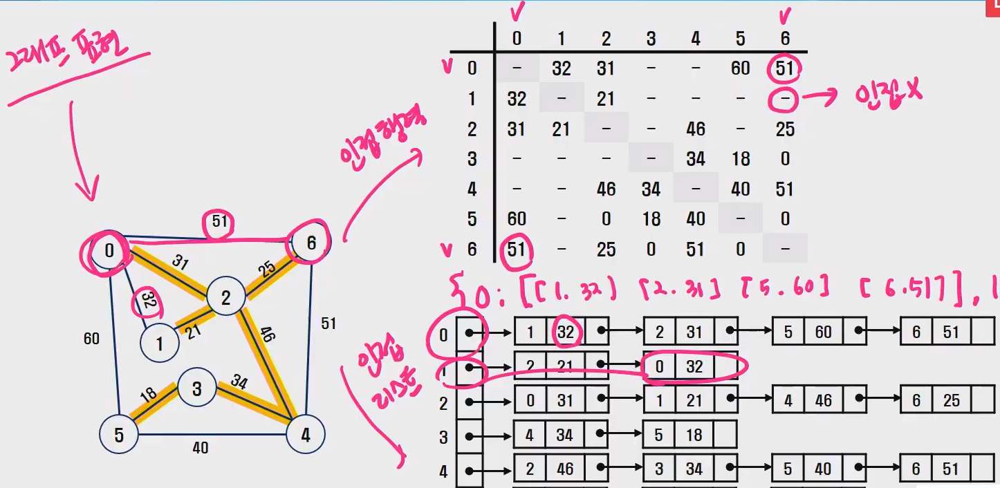
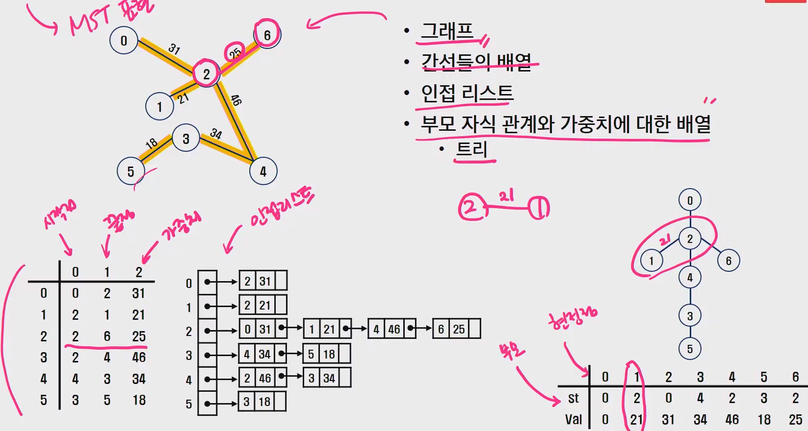
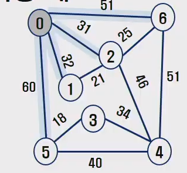
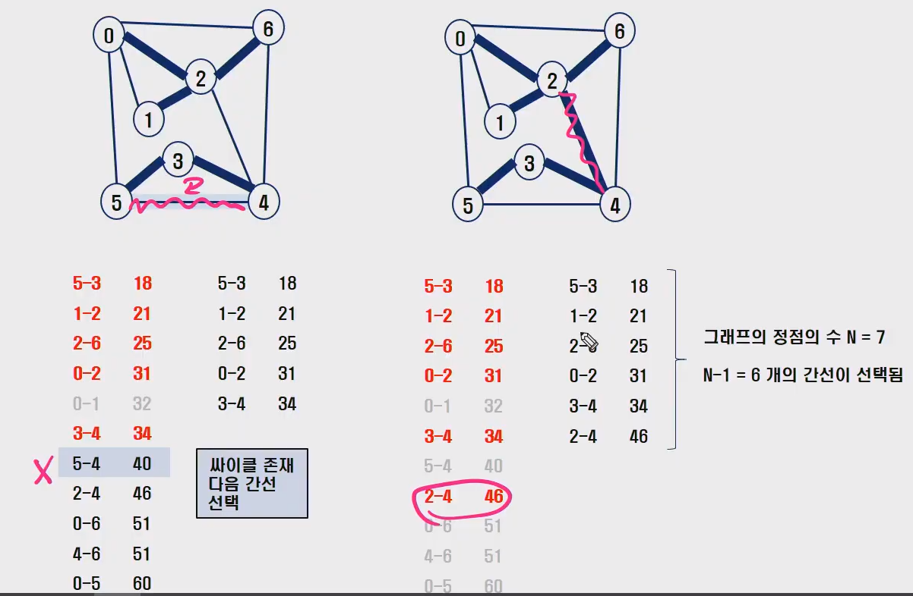
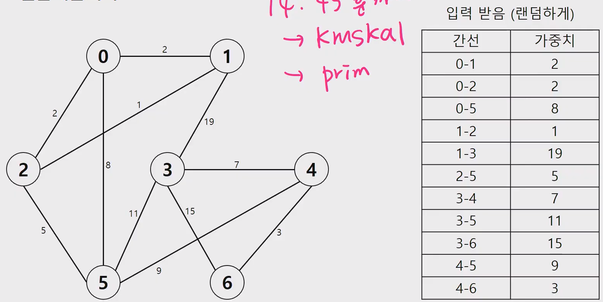

# 최소 비용 신장 트리 (MST)

> - 그래프에서  최소 비용 문제
>
>   - 모든 정점을 연결하는 간선들의 가중치의 합이 **최소**가 되는 트리 (MST)
>   - 두 정점 사이의 최소 비용의 경로 찾기
>
> - 신장 트리
>
>   - n개의 정점으로 이루어진 무방향 그래프에서 n개의 정점과
>     n-1개의 간선으로 이루어진 트리
>
> - **최소 신장 트리 (Minimum Spanning Tree)**
>
>   - 무방향 가중치 그래프에서 신장 트리를 구성하는 간선들의 가중치의 합이 최소인 신장트리
>
>   
>
> - **알고리즘**
>
>   - 프림 알고리즘
>     - 정점을 하나씩 선택하면서 MST 만듦
>   - 크루스칼 알고리즘
>     - 간선을 하나씩 선택하면서 MST 만듦 (간선 가중치 오름차순)
>   - [다익스트라(?)]([https://ko.wikipedia.org/wiki/%EB%8D%B0%EC%9D%B4%ED%81%AC%EC%8A%A4%ED%8A%B8%EB%9D%BC_%EC%95%8C%EA%B3%A0%EB%A6%AC%EC%A6%98](https://ko.wikipedia.org/wiki/데이크스트라_알고리즘))


**:cupid: MST 표현(1)**

> 인접 행렬 / 인접 리스트




**:cupid: MST 표현(2)**

- 그래프
- 간선들의 배열
- 인접 리스트
- 부모 자식 관계와 가중치에 대한 배열
  - 트리




## **:one: Prim 알고리즘**

> - MST 를 구하기 위한 알고리즘 중 하나
> - 하나의 정점에서 연결된 간선들 중에 **정점을 하나씩 선택하면서 MST 만드는 방식**


- 하나의 정점에서 연결된 간선들 중에 하나씩 선택하면서 MST를 만들어 가는 방식

  - 임의 정점을 하나 선택해서 시작
  - 선택한 정점과 인접하는 정점들 중의 최소 비용의 간선이 존재하는 정점을 선택
  - 모든 정점이 선택될 때 까지 위 과정 반복

- 서로소인 2개 집합(2 disjoint-sets) 정보를 유지

  - 트리 정점들(tree vertices) - MST를 만들기 위해 선택된 정점들
  - 비트리 정점들(nontree vertices) - 선택 되지 않은 정점들


**MST에서 비MST 로 가는 간선중 가중치가 가장 낮은것..**

- MST 에 포함된 모든 노드들의 인접중 가중치가 가장 낮은 것
- **마지막에 MST 에 포함된 노드에서만 비교하는게 아님!! XXXXX**




|  시작정점   |    0 |    1 |    2 |    3 |    4 |    5 |    6 |
| :---------: | ---: | ---: | ---: | ---: | ---: | ---: | ---: |
|   부모(π)   |    0 |    2 |    0 |    4 |    2 |    3 |    2 |
| 가중치(key) |    0 |   21 |   31 |   34 |   46 |   18 |   25 |


- **prim 알고리즘 순서**

  - π , key 초기화 ( -1, 무한 )

  - 시작정점 key[시작점] = 0

  - 아직 MST 가 아니면서 key가 최소인 정점 선택 => u

  - u 를 MST로 선택

  - u 에 인접하고, 아직 MST가 아닌 정점 w

    - key[w] > u - w 가중치
      - 갱신

  - 슈도코드

    ```python
    def MST_Prim(Graph, startV): # 그래프, 시작 정점
        for u in G.V: # 모든정점
            u.key = 무한
            u.파이 = Null # 트리에서 u의 부모
        r.key = 0
        Q = G.V # 우선순위 Q에 모든 정점 넣는다. 우선순위에 따라 꺼내옴
        
        while Q != 0:
            u = Extract_MIN(Q) # key 값이 가장 작은 정점 가져오기
            for v in G.Adj[u]
            if v 가 Q에 속하나 and w(u, v) < v.key: # Q 에 있는 v의 key값 갱신
                v.파이 = u
                v.key = w(u, v)   
    ```

    

**:cupid: Prim 알고리즘 파이썬 코드.py**

- **MST 구하기 - prim 알고리즘_인접행렬**

```python
# MST + 인접행렬
'''
입력
7 11
0 5 60 # 시작, 도착, 가중치
0 1 32
0 2 31
0 6 51
1 2 21
2 4 46
2 6 25
3 4 34
3 5 18
4 5 40
4 6 51

출력
[0, 21, 31, 34, 46, 18, 25]
175
'''
V, E = map(int, input().split())
adj = [ [0] * V for _ in range(V) ] # 인접행렬
for i in range(E):
    s, e, c = map(int, input().split())
    # 무방향
    adj[s][e] = c
    adj[e][s] = c
# for row in adj:
#     print(row)

# key, p, mst 준비
INF = float('inf')
# 초기화
key = [INF] * V
p = [-1] * V
mst = [False] * V

# 시작점 선택 : 0번 선택
key[0] = 0
cnt = 0
result = 0
while cnt < V:
    # 아직 mst가 아니고, key가 최소인 정점 선택 : u
    min = INF
    u = -1
    for i in range(V):
        if not mst[i] and key[i] < min:
            min = key[i]
            u = i
    # u를 mst로 선택
    mst[u] = True
    result += min
    cnt += 1
    # key값을 갱신
    # u에 인접하고 아직 mst가 아닌정점 w에서 key[w] > u-w 가중치면 갱신
    for w in range(V):
        if adj[u][w] > 0 and not mst[w] and key[w] > adj[u][w]:
            key[w] = adj[u][w]
            p[w] = u

print(key)
print(p)
print(result)
```


- **MST 구하기 - prim 알고리즘_인접리스트**

```python
'''
MST + 인접리스트
7 11
0 5 60
0 1 32
0 2 31
0 6 51
1 2 21
2 4 46
2 6 25
3 4 34
3 5 18
4 5 40
4 6 51

결과
[0, 21, 31, 34, 46, 18, 25]
175
'''
from pprint import pprint
import heapq

V, E = map(int, input().split())
adj = {i : [] for i in range(V)}
for i in range(E):
    s, e, c = map(int, input().split())
    adj[s].append([e,c])
    adj[e].append([s,c])
pprint(adj) # 인접리스트

# key, mst, 우선순위큐 준비
INF = float('inf')
key = [INF] * V
mst = [False] * V
pq = []

# 시작정점 선택 : 0
key[0] = 0

# 우선순위 큐 -> 이진힙 구현 lib -> heapq 라이브러리 사용
# 큐에 시작 정점을 넣음 => (key, 정점인덱스)
heapq.heappush(pq, (0, 0))  # 우선순위큐 -> 원소의 첫번째요소 -> key를 우선순위로
result = 0
while pq:
    # 최소값 찾기
    k, node = heapq.heappop(pq)
    if mst[node]:
        continue
    # mst로 선택
    mst[node] = True
    result += k
    # key 갱신 => key배열 / 큐
    for dest, wt in adj[node]: # 갈곳, 가중치
        if not mst[dest] and key[dest] > wt:
            key[dest] = wt
            # 큐 갱신 -> 새로운 (key, 정점) 삽입 -> 필요없는 원소는 스킵
            heapq.heappush(pq, (key[dest], dest))
  
print(result) # 175 (최소신장트리 가중치 합)
```


## :two: Kruskal 알고리즘

> - 간선을 하나씩 선택해서 MST 를 찾는 알고리즘
>   - 최초, 모든 간선을 가중치에 따라 **오름차순**으로 정렬
>   - 가중치가 가장 낮은 간선부터 선택하면서 트리를 증가시킴
>     - 사이클이 존재하면 당므으로 가중치가 낮은 간선 선택
>   - n-1 개의 간선이 선택될 때 까지 2번째를 반복
>
> 
>
> - 정점의 개수가 V = 7개 일때는 간선 6개를 선택하면 종료한다.


**:cupid: 사이클 찾는방법**

0 정점의 대표자 => 0

2 정점의 대표자 => 0

**즉 정점의 대표자가 같으면, 싸이클이 발생한다.**




V : 정점  수

V-1 개의 간선이 선택될 때 까지 반복한다.


**:cupid: 크루스칼 알고리즘 슈도코드**

```python
def MST_Kruskal(Graph, w):
    A = 0
    for v, in Graph.V: # 그래프의 모든 정점
        Make_Set(v)
        
    # Graph.E 에 포함된 간선들의 가중치 w 에 의해 정렬
    
    for 가중치 낮은 간선 (u, v) ∈ Graph.E (V-1개):
        # 싸이클 처리 (대표자가 같지 않으면 합친다.)
        if Find_Set(u) != Find_Set(v):
            A = A U {(u, v)}
            Union(u, v)
    
    return A
```


**:cupid: 크루스칼 알고리즘 파이썬 코드.py**

```python
'''
입력
7 11
0 5 60
0 1 32
0 2 31
0 6 51
1 2 21
2 4 46
2 6 25
3 4 34
3 5 18
4 5 40
4 6 51
'''
def make_set(x):
    p[x] = x

def find_set(x): # 대표자를 리턴해주는 함수
    if p[x] == x:
        return x
    else:
        p[x] = find_set(p[x])
        return p[x]

def union(x, y):
    px = find_set(x)
    py = find_set(y)
    if rank[px] > rank[py]:
        p[py] = px
    else:
        p[px] = py
        if rank[px] == rank[py]:
            rank[py] += 1 # 랭크가 같으면 최종부모(py)를 +1


V, E = map(int, input().split())
edges = [ list(map(int, input().split())) for i in range(E) ]
# 가중치 오름차순 정렬
edges.sort(key=lambda x:x[2]) # 내가 x를 주면 x의 2번째를 리턴해줘
# print(edges)

# make_set : 모든 정점에 대해 집합 생성
p = [0] * V
rank = [0] * V # 내 노드의 서브트리의 높이
for i in range(V):
    make_set(i)

# 모든 간선에 대해서 반복 -> V-1개의 간선이 선택될때까지
cnt = 0
result = 0
mst = []
for i in range(E):
    start, end, weight = edges[i][0], edges[i][1], edges[i][2] # 시작, 도착, 가중치

    # 사이클이면 Skip : 간선의 두 정점이 서로 같은 집합이면, -> find_set -> 대표자 같음
    if find_set(start) == find_set(end):
        continue

    result += weight
    # 간선 선택
    #   => mst에 간선 정보 더하기 / 두 정점을 합친다. -> union
    mst.append(edges[i])
    union(start, end)
    cnt += 1
    if cnt == V-1:
        break

print(result)
print(mst)
```


**:cupid:  Kruskal 알고리즘 연습**

