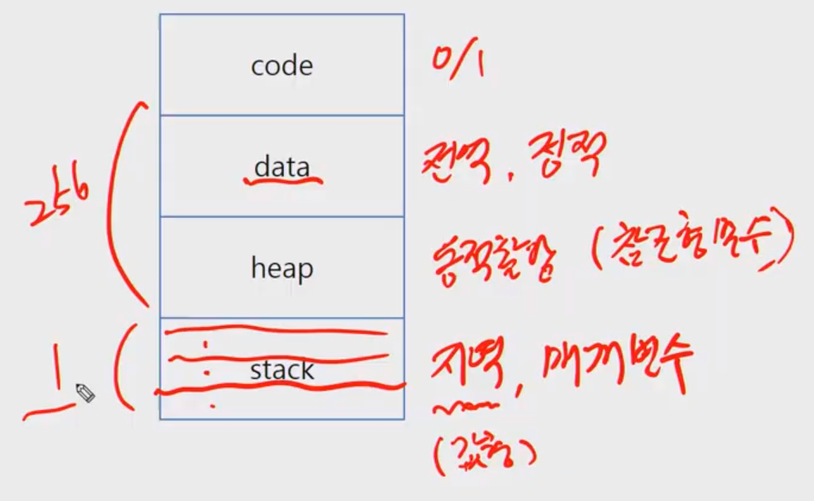
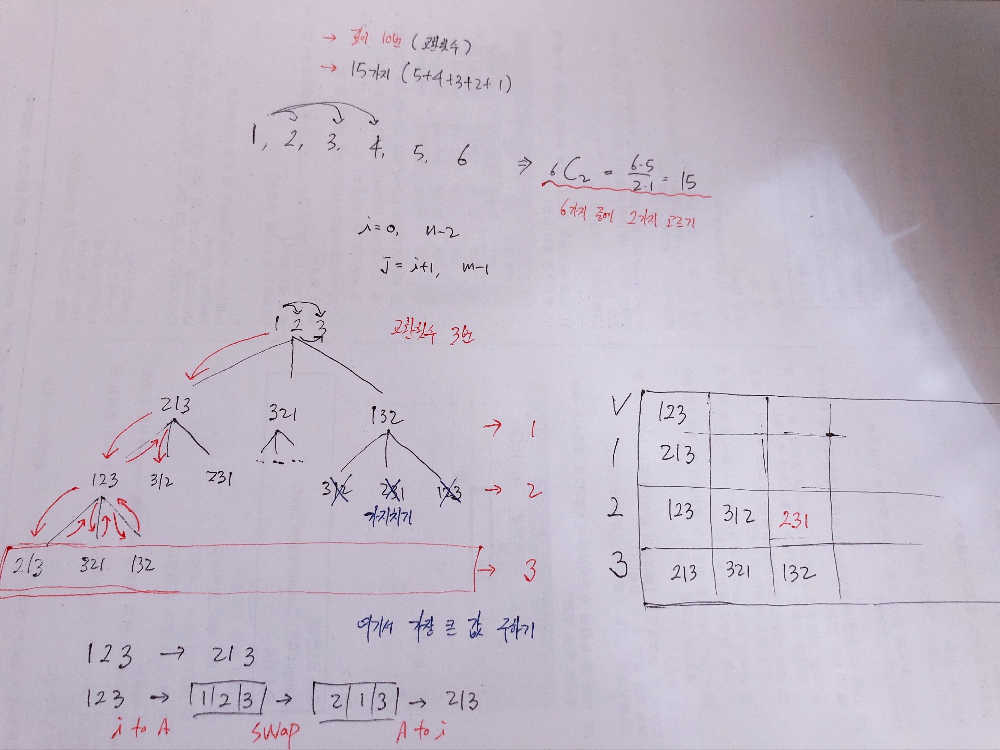

# 문제풀이

> A형 문제
>
> - 시간 3시간
> - 1문제 pass : A 
> - 2문제 pass : A+
> - 완전검색 + 가지치기 , 시뮬레이션

**문제풀이 순서**

- 소프트웨어 공학의 <폭포수모형>
  - 요구사항 분석
  - 설계
  - 구현
  - 테스트
  - 유지보수


**알고리즘 설계 기법**

- 탐욕
  - 검증없이 그냥 머릿속에 있는것을 구현하는것
- **완전검색**
  - 시간내에 못풀릴수도 있다. ( + 가지치기 )
  - 재귀함수로 해야한다. (DFS)
- **백트래킹**
- 분할정복
- 동적계획법
  - Dynamic Programming ( DP )


**메모리 구조**

- 시간
- 메모리
  Code : 0/1
  Data : 전역변수, 정적변수
  Heap : 동적할당 (참조형 변수)
  Stack : 지역, 매개변수



- 값형 (read only)

  - 정수
  - 실수

- 참조형 (Heap 에 만들어짐)

  - 리스트
  - 딕셔너리
  - 객체

  

**메모이제이션**

컴퓨터 프로그램을 실행할 때 이전에 계산한 값을 메모리에 저장해서 매번 다시 계산하지 않도록 하여
전체적인 실행속도를 빠르게 하는 기술


## [1244_최대상금](https://swexpertacademy.com/main/code/problem/problemDetail.do?contestProbId=AV15Khn6AN0CFAYD)

> 완전검색 + 가지치기

최대 자리수 6자리

최대 교환횟수 10번




## [1247_최적경로](https://swexpertacademy.com/main/code/problem/problemDetail.do?contestProbId=AV15OZ4qAPICFAYD)

> DFS + 가지치기(백트래킹)
>
> - 완전탐색
>
>   - 순열, 중복순열
>
>     - nPr / nπn
>     - 뽑아서 나열
>
>     
>
>   - 조합, 중복조합
>
>     - nCr, nHr
>     - 뽑기만 함
>
>     
>
>   - 부분집합
>
>     - 공집합 과 자기자신 포함

- **순열 구하는 방식 4가지**
  1. for
  2. swap
  3. backtracking
  4. **visited**


- TSP

`회사 -> {1,2,3,4,5} -> 회사`


- 입력/출력

```
'''
입력
10
5
0 0 100 100 70 40 30 10 10 5 90 70 50 20
6
88 81 85 80 19 22 31 15 27 29 30 10 20 26 5 14
10
39 9 97 61 35 93 62 64 96 39 36 36 9 59 59 96 61 7 64 43 43 58 1 36

출력
#1 200
#2 304
#3 366
'''
```


- 코드

```python
def route(cur, s, cnt): # 좌표(x, y), 현재까지의 이동거리, 횟수
    global N, sumV

    # 백트래킹 (최소거리sumV 보다 s 현재거리가 더 클때 바로 return)
    if s >= sumV:
        return

    # 고객 전부 만날때,
    if cnt == N:
        s += abs(cur[0] - end[0]) + abs(cur[1] - end[1])
        if sumV > s:
            sumV = s
        return

    for i in range(len(L)):
        if visited[i]:
            continue
        visited[i] = 1
        route(L[i], s + abs(cur[0] - L[i][0]) + abs(cur[1] - L[i][1]), cnt + 1)
        visited[i] = 0


T = int(input())
for tc in range(1, T+1):
    N = int(input()) # 5
    l = list(map(int, input().split())) 

    L = [] # 고객 좌표 들어갈 배열
    sumV = float('inf') # 최소값 구하기 위해 최대값으로 초기화


    # 회사, 집, 고객좌표 값 받아오기
    for i in range(N+2):
        if i == 0:
            start = (l[i], l[i + 1]) # 회사
        elif i == 1:
            end = (l[2*i], l[2*i + 1]) # 집
        else:
            L.append((l[2*i],l[2*i + 1])) # 고객 좌표

    visited = [0] * len(L)


    route(start, 0, 0)
    print(f'#{tc} {sumV}')
```


- 재귀호출 부분
  - 여기서 모든 경우의 수를 모두 행하게 된다. DFS 방식으로.


