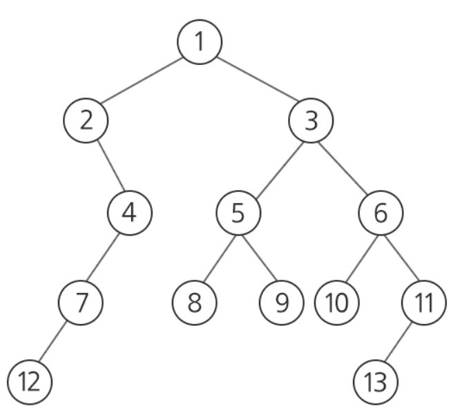

# 문제풀이2

## :one: [공통조상](https://swexpertacademy.com/main/code/problem/problemDetail.do?contestProbId=AV15PTkqAPYCFAYD)

> - 비선형구조
>   - 그래프
>     - 표현방법
>       - 인접행렬, 인접리스트,
>     - 순회
>       - DFS, BFS
>     - 종류
>       - 트리
>       - 표현방법
>         - 1차원
>         - 2차원 (left, right, parent)

- 저장방법
  - V가 13번지 있지만 생략하여서 5번까지 저장한 표 만듦.

| Node (V) | Left | Right | Parent |
| -------- | :--: | :---: | :----: |
| 1        |  2   |   3   |   0    |
| 2        |  4   |   0   |   1    |
| 3        |  5   |   6   |   1    |
| 4        |  7   |   0   |   2    |
| 5        |  9   |   8   |   3    |
| ...      | ...  |  ...  |  ...   |

