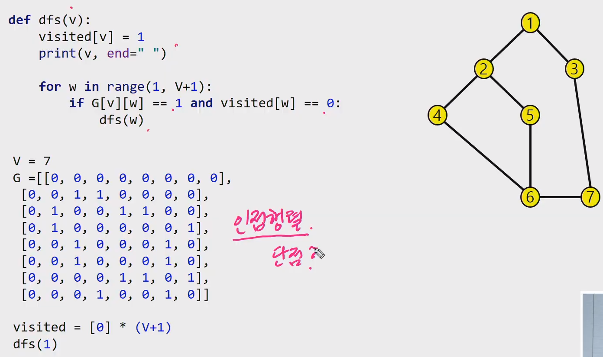
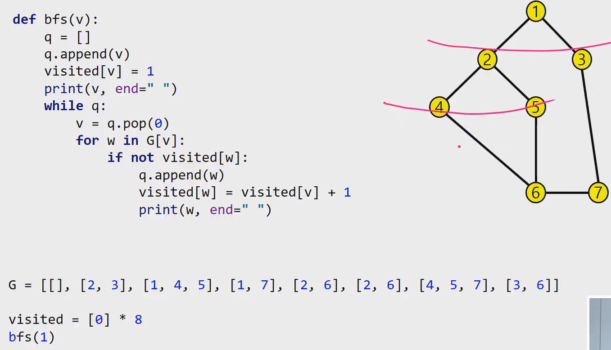

# 그래프 문제풀이

**그래프**

- 다익스트라 ( 최단경로 구하기 )
- MST
  - 프림
  - 크루스칼


## :one: 상원이 생일파티

> [문제보기](https://swexpertacademy.com/main/code/problem/problemDetail.do?contestProbId=AWWO3kT6F2oDFAV4)
>
> 상원이의 친한친구의 친한친구까지이므로 BFS 에서 visited 2, 3 까지만 초대장 보낸다는 의미

**Graph**

- 표현방법
  - 인접행렬, 인접리스트
- 순회
  - DFS, BFS


```python
def bfs(v):
    q = []
    q.append(v)
    visited[v] = 1

    while q:
        v = q.pop(0)
        for w in G[v]:
            if not visited[w]:
                q.append(w)
                visited[w] = visited[v] + 1


T = int(input())
for tc in range(1, T+1):
    N, M = map(int, input().split()) # 반에 N명 / M 은 친한친구 관계의 수

    # 인접리스트 Graph
    G = [[] for _ in range(N+1)]
    for _ in range(M):
        a, b = map(int, input().split())
        G[a].append(b)
        G[b].append(a)
    # print(G)

    visited = [0] * (N + 1)

    bfs(1)

    cnt = 0
    for num in visited:
        if num == 2 or num == 3:
            cnt += 1

    print('#{} {}'.format(tc, cnt))
```


## :two: DFS

> 깊이우선탐색 => Stack 이용
>
> 아래 그림은 **그래프를 인접행렬로 표현**하였음.
>
> 1번~7번 노드까지라서 그래프를 V+1 만큼 만들었음 ( idx 편하게 쓰기위해서 )




## :three: BFS

> 너비우선탐색 => Queue 이용
>
> 아래그림에서는 **그래프를 인접리스트로 표현**하였음




## :four: 보급로 문제

> 지도의 크기 최대 100x100 이므로 DFS 불가능 (스택재귀 허용치 초과)
>
> BFS 로 풀어야한다. ( 가중치 다익스트라 알고리즘 사용 )

- 최단경로 알고리즘
  - 플로이드 알고리즘 O(n^3)
  - **다익스트라..**


