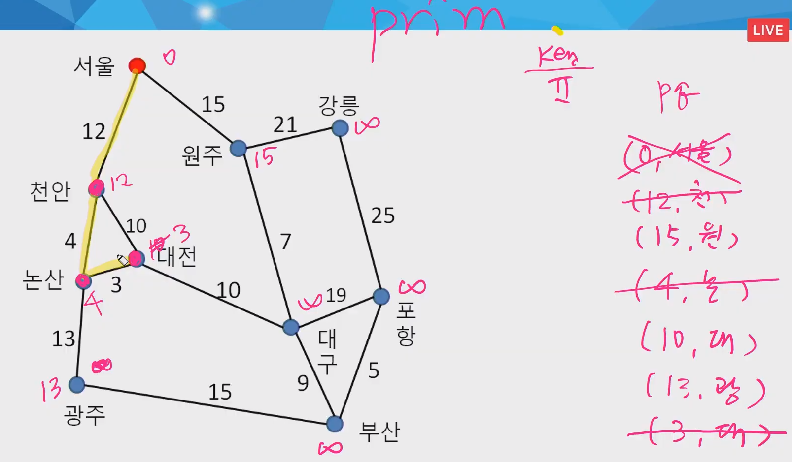

# 문제풀이


## :one: 장훈이의 높은선반

> 부분집합 활용 문제
>
> [부분집합 참고문서](https://20chally.tistory.com/107)


**:cupid: 라이브러리 `itertools / combinations` 사용 코드**

```python
from itertools import combinations

T = int(input())
for tc in range(1, T+1):
    # 입력 받기
    N, B = map(int, input().split())
    heights = list(map(int, input().split()))
    
    # 최소값 초기화
    min_num = float('inf')
    
    # 모든 조합가능한 경우 찾기 
    for i in range(1,N+1):
        temp = combinations(heights, i)
        for j in temp:
            if sum(j) >= B:
                if sum(j) < min_num:
                    min_num = sum(j)
	
    # 정답 출력
    print('#{} {}'.format(tc, min_num-B))
```


**:cupid: 재귀함수 메모이제이션 사용 부분집합 코드**

```python
def powerset(n, d, total): #d: depth
    global minV, B

    if total == B:
        minV = 0
    elif total > B:
        minV = min(total - B, minV)
        return
    elif n == d:
        return

    else:
        used[d] = 1
        powerset(n, d+1, total+heights[d])
        used[d] = 0
        powerset(n, d+1, total)


T = int(input())
for tc in range(1, T+1):
    N, B = map(int, input().split())            # 5명, 선반높이16
    heights = list(map(int, input().split()))   # [1, 3, 3, 5, 6]

    minV = float('inf')
    used = [ 0 for _ in range(N) ]            # [0, 0, 0, 0, 0]

    powerset(N, 0, 0)
    print(f'#{tc} {minV}')
```


## :two: 인수의 생일파티

> 양방향 다익스트라 문제
>
> [문제보기](https://swexpertacademy.com/main/code/problem/problemDetail.do?contestProbId=AV4xuqCqBeUDFAUx)


## :three: 하나로

> 최소신장트리(MST)
>
> - **Prim** ( O(n^2) ) - 다익스트라와 유사
> - Kruskal ( O(nlogn) ) - n 간선의 개수
>
> 
>
> 실제예시)
>
> 송유관, 네트워크선 설치



